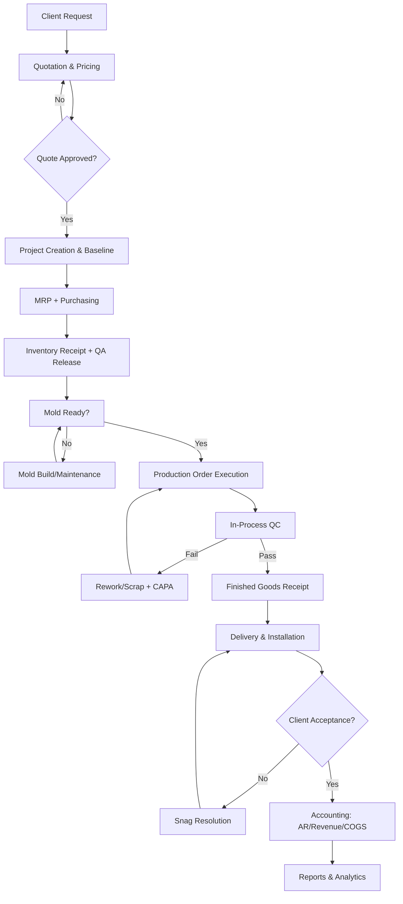
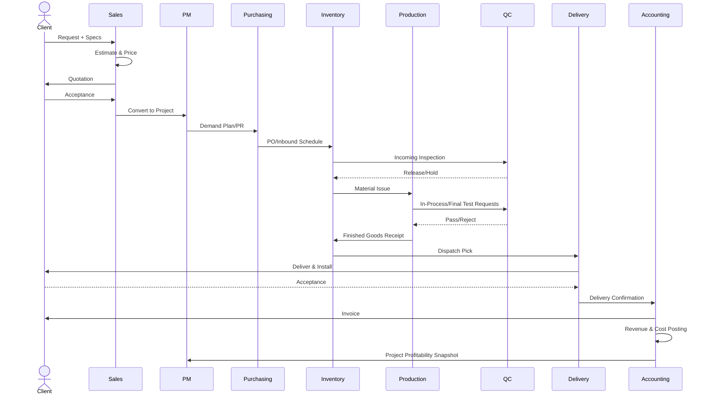
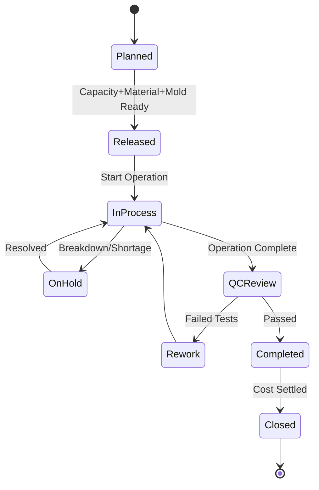
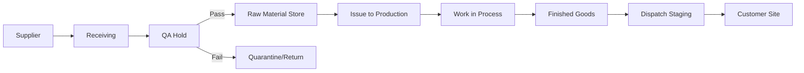
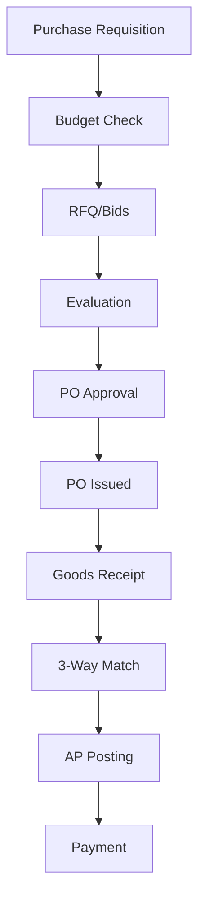
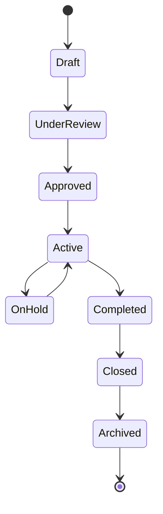
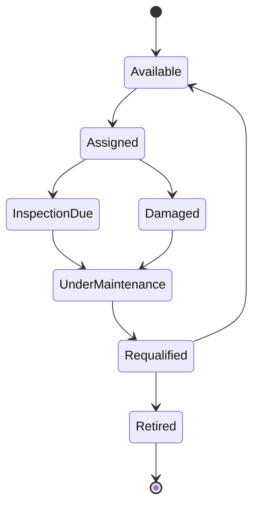
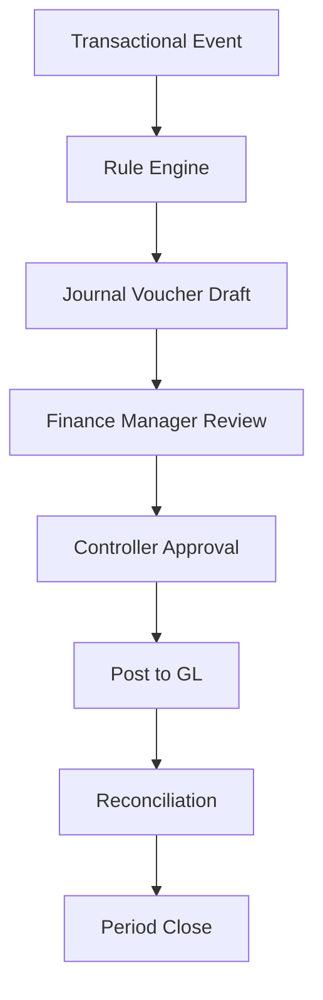

# Complete Workflow Analysis — ERP System for Concrete Manufacturing Factory

## 1) Projects Management
### 1. Overview
Projects Management is the orchestration hub that transforms approved sales opportunities into executable work packages. It controls scope, milestones, budget baseline, ownership, progress tracking, and inter-module dependencies.

### 2. Objectives
- Convert approved quotations into controlled projects.
- Define deliverables, WBS, timelines, and accountability.
- Track planned vs actual cost/revenue/progress.
- Control change requests and project governance.

### 3. Actors
- Sales Manager
- Project Manager
- PMO Controller
- Finance Controller
- Operations Director
- Client Representative

### 4. Inputs
- Approved quotation and contract terms
- Client master and site details
- Delivery commitments
- Initial BOM/BOM alternatives
- Resource capacity snapshots

### 5. Outputs
- Project charter and baseline
- Work breakdown structure (WBS)
- Project budget and cost centers
- Milestone plan and deadlines
- Change logs and progress reports

### 6. Step-by-step workflow
1. Convert approved quotation to project draft.
2. Assign project code, legal entity, and branch.
3. Define scope packages (products, installation, extras).
4. Generate milestones (design, mold prep, production, delivery, closeout).
5. Allocate provisional budget lines by cost type.
6. Run feasibility checks against resource calendars.
7. Submit project for internal approval.
8. Lock baseline version and activate project.
9. Issue downstream demands (purchase requests, production demand, mold demand).
10. Capture progress updates and earned value.
11. Process scope/cost/time change requests.
12. Close project after financial and operational closure.

### 7. Exceptions and validations
- Duplicate client PO number rejected.
- Project activation blocked if mandatory contract attachments missing.
- Date validation: delivery date cannot precede production start.
- Change request above threshold requires executive approval.

### 8. Business rules
- Every active project must map to one cost center hierarchy.
- Baseline cannot be edited after approval; only revised via versioning.
- No material issue to production without project-task reference.

### 9. Database entities involved
`Project`, `ProjectVersion`, `ProjectMilestone`, `ProjectTask`, `ProjectCostBaseline`, `ProjectChangeRequest`, `ProjectStakeholder`, `ProjectDocument`

### 10. API actions required
- `POST /api/projects/from-quotation/{quotationId}`
- `PUT /api/projects/{id}/baseline`
- `POST /api/projects/{id}/change-requests`
- `POST /api/projects/{id}/activate`
- `GET /api/projects/{id}/progress`

### 11. Notifications and approvals
- PM notified on project draft creation.
- Finance notified for budget validation.
- Ops Director approval for activation.
- Client-facing milestone notices via portal/email.

### 12. Status lifecycle
`Draft -> UnderReview -> Approved -> Active -> OnHold -> Completed -> Closed -> Archived`

### 13. Relationships with other modules
Strongly connected to Quotations, Purchasing, Inventory, Production, Delivery, Accounting, Reports.

### 14. Risks and edge cases
- Scope creep without approved change.
- Underestimated mold lead time.
- Client revisions after procurement commitment.

### 15. Automation opportunities
- Auto-generate WBS template by project type.
- Auto-budget by historical cost model.
- Predict schedule slippage from variance signals.

---

## 2) Quotations & Pricing
### 1. Overview
Handles estimation, margin simulation, discount governance, and commercial approval to produce controlled quotations aligned with manufacturing realities.

### 2. Objectives
- Produce accurate, profitable quotes.
- Standardize pricing policies and approvals.
- Tie every quote line to cost drivers (mix, mold, labor, logistics).

### 3. Actors
Sales Engineer, Estimator, Pricing Manager, Finance Approver, Client.

### 4. Inputs
Client inquiry, drawings/specs, quantity schedule, delivery locations, payment terms, tax setup.

### 5. Outputs
Approved quotation, pricing breakdown, validity terms, commercial assumptions.

### 6. Workflow
1. Register opportunity.
2. Capture technical and commercial requirements.
3. Estimate raw material cost from mix candidate.
4. Estimate mold amortization and setup.
5. Add production, labor, overhead, logistics, installation costs.
6. Apply risk contingency.
7. Simulate margin at multiple discount levels.
8. Route for tiered approval based on discount/margin policy.
9. Publish quotation and revision tracking.
10. Convert won quote to project.

### 7. Exceptions/validations
- Quote expiry enforced.
- Discount ceiling validation by role.
- Missing technical specs blocks final approval.

### 8. Business rules
- Margin floor per product family.
- Tax and freight policy based on delivery Incoterm.
- Any negative margin line requires CFO override.

### 9. Entities
`Quotation`, `QuotationRevision`, `QuotationLine`, `PriceComponent`, `DiscountApproval`, `CommercialTerm`.

### 10. APIs
`POST /api/quotations`, `POST /api/quotations/{id}/price-calc`, `POST /api/quotations/{id}/submit`, `POST /api/quotations/{id}/approve`, `POST /api/quotations/{id}/convert-project`.

### 11. Notifications/approvals
Approval chain: Pricing Manager -> Finance Controller -> Commercial Director.

### 12. Status lifecycle
`Draft -> Priced -> Submitted -> UnderApproval -> Approved -> Sent -> Negotiation -> Won/Lost -> Converted`

### 13. Relationships
Feeds Projects; consumes Mix, Mold, Inventory reference costs.

### 14. Risks
Wrong cost basis, outdated rates, uncontrolled discounting.

### 15. Automation
Dynamic pricing engine, auto-risk surcharge, template quote packs.

---

## 3) Mold Management
### 1. Overview
Manages mold asset lifecycle from planning, fabrication/procurement, usage tracking, maintenance, and retirement.

### 2. Objectives
- Ensure mold availability and health.
- Optimize mold utilization and lifecycle cost.

### 3. Actors
Mold Engineer, Maintenance Planner, Production Planner, Storekeeper, QA.

### 4. Inputs
Product geometry, production volume forecast, mold spec, maintenance policy.

### 5. Outputs
Mold master, readiness status, maintenance orders, usage logs.

### 6. Workflow
1. Determine mold requirement from project/product.
2. Check existing mold inventory and compatibility.
3. Create mold acquisition/fabrication request.
4. Register mold asset and technical spec.
5. Pre-production inspection and release.
6. Assign mold to production order.
7. Track cycle count and wear indicators.
8. Trigger preventive/corrective maintenance.
9. Re-qualify mold post-maintenance.
10. Retire/scrap mold at end of life.

### 7. Exceptions
- Mold damage during run -> immediate hold.
- Cycle-count threshold breach blocks assignment.

### 8. Business rules
- Critical molds require dual QA+Maintenance release.
- Max cycles by mold class.

### 9. Entities
`Mold`, `MoldComponent`, `MoldAssignment`, `MoldMaintenanceOrder`, `MoldInspection`, `MoldLifecycleEvent`.

### 10. APIs
`POST /api/molds`, `POST /api/molds/{id}/inspect`, `POST /api/molds/{id}/assign`, `POST /api/molds/{id}/maintenance`, `POST /api/molds/{id}/retire`.

### 11. Notifications/approvals
Maintenance alerts, assignment approvals for constrained molds.

### 12. Status lifecycle
`Requested -> InFabrication/Procurement -> Received -> Qualified -> Available -> Assigned -> UnderMaintenance -> Requalified -> Retired`

### 13. Relationships
Production, QA, Purchasing, Equipment, Accounting (depreciation).

### 14. Risks
Late mold readiness, untracked wear, wrong mold assignment.

### 15. Automation
Cycle counter IoT integration, predictive maintenance.

---

## 4) Mix Design
### Overview/Objectives/Actors
Defines concrete recipes that satisfy strength, durability, and cost targets while respecting available materials.
Actors: Mix Designer, Lab Technician, QA Manager, Production Engineer.

### Inputs
Target strength class, exposure class, slump/workability, aggregate/cement availability, admixture constraints, ambient conditions.

### Outputs
Approved mix formula with tolerances and QC test plan.

### Step-by-step workflow
1. Initiate mix request.
2. Select candidate formulas.
3. Compute theoretical proportions and cost.
4. Create lab trial batch.
5. Test fresh concrete (slump, temperature, air).
6. Cast specimens and cure.
7. Evaluate 7/28-day strength and durability tests.
8. Optimize cost/performance.
9. Approve mix and publish version.
10. Lock for project/PO or allow controlled substitutions.

### Exceptions/validations
- Strength test below threshold -> reject version.
- Material substitution requires QA and client approval if contract-bound.

### Business rules
- Mix versioning mandatory; no in-place overwrite.
- Production can use only Active+Released mix.

### Entities/APIs
Entities: `MixDesign`, `MixIngredient`, `MixTrial`, `LabTestResult`, `MixApproval`, `MixVersion`.
APIs: `/api/mix-designs`, `/api/mix-designs/{id}/trials`, `/api/mix-designs/{id}/approve`, `/api/mix-designs/{id}/release`.

### Notifications/Status/Relations/Risks/Automation
Status: `Draft -> Trial -> Testing -> UnderReview -> Approved -> Released -> Superseded/Archived`.
Relations: QC, Inventory, Production, Quotations.
Automation: suggestion engine using historical pass rates and cost.

---

## 5) Inventory Management
### Overview
Controls material and finished goods movement, valuation, and traceability across warehouses, plants, and project sites.

### Objectives
Availability, accuracy, traceability, minimal stockouts/overstock.

### Actors
Warehouse Manager, Storekeeper, Inventory Controller, Cost Accountant, QA Inspector.

### Inputs
PO receipts, production issues/returns, stock transfers, delivery picks, adjustments.

### Outputs
Real-time stock ledger, batch traceability, valuation postings.

### Workflow
1. Define item master/UOM/lot policy.
2. Receive goods against PO/GRN.
3. QA hold/release inbound stock.
4. Putaway by location strategy.
5. Reserve stock for production/project.
6. Issue raw materials to production order.
7. Receive finished goods from production.
8. Pick/pack for delivery.
9. Process returns and scrap.
10. Cycle count and reconciliation.

### Exceptions/validations
Negative stock prevention, lot expiry checks, quarantine-only movement restrictions.

### Business rules
FEFO/FIFO by item class; mandatory lot tracking for cement/admixtures/critical components.

### Entities
`Item`, `Warehouse`, `Bin`, `InventoryLot`, `InventoryTransaction`, `StockReservation`, `CycleCount`, `Adjustment`.

### APIs
`/api/inventory/receipts`, `/api/inventory/issues`, `/api/inventory/transfers`, `/api/inventory/reservations`, `/api/inventory/counts`.

### Status lifecycle
For lot: `Received -> QAHold -> Released -> Reserved -> Issued/Dispatched -> Closed`.

### Automation
Auto-reorder points, anomaly detection, barcode/RFID scanning.

---

## 6) Purchasing
### Overview/Objectives
Procures raw materials, molds, services, and spare parts under controlled sourcing and approval.

### Actors
Requester, Buyer, Procurement Manager, Finance, Supplier, Receiving.

### Inputs/Outputs
Inputs: PRs, stock alerts, project demand.
Outputs: RFQ, comparative statements, PO, supplier performance.

### Workflow
1. Generate purchase requisition (PR).
2. Budget availability check.
3. RFQ issuance and bid collection.
4. Technical/commercial evaluation.
5. Supplier selection.
6. PO approval by authority matrix.
7. PO dispatch and acknowledgment.
8. Receipt and 3-way match.
9. Invoice approval and payment scheduling.

### Exceptions
Single-source justification mandatory; tolerance breaches require re-approval.

### Rules
No PO release without approved PR and budget.

### Entities/APIs/Status
Entities: `PurchaseRequisition`, `RFQ`, `SupplierBid`, `PurchaseOrder`, `GRN`, `SupplierInvoice`.
Status: `PR Draft -> Approved -> RFQ -> Evaluated -> PO Approved -> Ordered -> PartiallyReceived -> Closed`.
APIs: `/api/purchasing/pr`, `/api/purchasing/rfq`, `/api/purchasing/po`, `/api/ap/invoices/three-way-match`.

### Automation
Vendor scoring, lead-time prediction, auto-PO for framework contracts.

---

## 7) Production Management
### Overview
Plans and executes manufacturing orders for precast/concrete products with full resource, material, mold, and shift control.

### Workflow (condensed)
Demand planning -> MPS -> MRP -> Production Order -> Resource assignment (labor/equipment/mold) -> Batch & pour -> Curing -> Demolding/finishing -> FG receipt -> performance/cost capture.

### Key items
- Status: `Planned -> Released -> InProcess -> QCReview -> Completed -> Closed`.
- Entities: `ProductionOrder`, `Operation`, `WorkCenter`, `BatchRecord`, `CuringRecord`, `ProductionVariance`.
- APIs: `/api/production/orders`, `/api/production/orders/{id}/release`, `/api/production/orders/{id}/report`.
- Exceptions: equipment breakdown, material shortage, QC failure.

---

## 8) Quality Control
### Overview
Applies incoming, in-process, and final quality gates with CAPA controls.

### Workflow
Inspection plan assignment -> sample collection -> tests -> disposition (pass/hold/reject) -> NCR/CAPA if needed -> retest -> release.

### Status
`Planned -> Sampling -> Testing -> Pass/Hold/Reject -> Closed`

### Entities/APIs
`InspectionLot`, `TestResult`, `NCR`, `CAPA`, `QualityRelease`.
`/api/qc/inspection-lots`, `/api/qc/tests`, `/api/qc/ncr`, `/api/qc/release`.

---

## 9) Delivery & Installation
### Overview
Schedules dispatch, route planning, site installation, and completion certification.

### Workflow
Delivery request -> load planning -> dispatch approval -> shipment -> POD -> installation tasks -> snag/punch resolution -> completion signoff.

### Status
`Requested -> Planned -> Dispatched -> Delivered -> Installed -> Accepted -> Closed`

### Entities/APIs
`DeliveryOrder`, `Shipment`, `ProofOfDelivery`, `InstallationTask`, `SiteIssue`.

---

## 10) Accounting & Cost Control
### Overview
Captures GL impact for all ERP events; enforces budget, AP/AR, costing, revenue recognition.

### Workflow
Event capture -> accounting rule engine -> journal posting -> reconciliation -> period close -> profitability reporting.

### Critical rules
- 3-way match before AP posting.
- Revenue recognition per contract milestones.
- Standard vs actual variance posting for production.

### Entities/APIs
`JournalEntry`, `LedgerAccount`, `CostCenter`, `ProjectCost`, `APInvoice`, `ARInvoice`, `Payment`, `RevenueSchedule`.

---

## 11) HR & Employees
### Overview
Manages workforce profiles, competencies, attendance, shift assignment, and labor costing linkage.

### Workflow
Employee onboarding -> skill matrix -> shift roster -> assignment to operations -> attendance capture -> overtime approval -> payroll integration.

### Entities
`Employee`, `Skill`, `Shift`, `Attendance`, `Assignment`, `TimesheetApproval`.

---

## 12) Equipment Management
### Overview
Maintains plant assets readiness and utilization.

### Workflow
Asset registration -> PM schedule -> condition monitoring -> WO execution -> downtime logging -> reliability analysis.

### Entities
`Equipment`, `MaintenancePlan`, `WorkOrder`, `BreakdownEvent`, `SparePartIssue`.

---

## 13) Reports & Analytics
### Overview
Enterprise BI layer consolidating operational and financial KPIs.

### Outputs
KPI dashboards: OTD, yield, scrap, margin, project EAC, supplier OTIF, inventory turns.

### Entities/APIs
`ReportDefinition`, `KpiSnapshot`, `DataMartJob`, `/api/reports/*`, `/api/analytics/kpi/*`.

---

# FINAL Unified End-to-End Workflow (Client Request -> Reporting)

## A) Deep workflow narrative
1. **Client Request Intake**: inquiry captured with specs, quantities, deadlines, site constraints.
2. **Quotation Engineering**: cost model combines mix, mold, production, logistics, installation, overhead, risk; approval chain validates margin and discounts.
3. **Project Approval & Activation**: won quote converts to project; baseline locked; cost center and milestones created.
4. **Procurement Planning**: MRP and stock gaps generate PRs; sourcing runs RFQ, bid evaluation, PO approvals.
5. **Inventory Inbound & Reservation**: GRN posted, QA hold/release, putaway, project reservations.
6. **Mold Lifecycle Execution**: molds acquired/qualified/assigned; maintenance and availability enforced.
7. **Production Lifecycle**: order released; labor/equipment assigned; batching/pouring/curing/demolding/finishing tracked.
8. **Quality Lifecycle**: in-process and final inspections with NCR/CAPA and rework loops.
9. **Delivery & Installation**: dispatch, transport, POD, installation, client acceptance.
10. **Financial Posting**: AP, inventory valuation, WIP, COGS, AR invoicing, revenue recognition, profitability.
11. **Reporting & Closure**: KPI consolidation, variance analysis, project closeout and archival.

## B) Approval chain (critical)
- Quotation: Pricing Manager -> Finance -> Commercial Director.
- Project activation: PMO -> Operations Director -> Finance.
- PR/PO: Department Head -> Procurement Manager -> Finance Controller.
- Production release: Production Manager + QA readiness.
- Delivery dispatch: Logistics Lead + Site readiness confirmation.
- Invoice/revenue: Finance Manager + Controller.

## C) Inventory movement map
- Supplier -> Receiving (QA Hold) -> Raw Material Storage -> Issued to Production -> WIP -> Finished Goods -> Dispatch Staging -> Customer Site.
- Reverse paths: returns, rejected lots to quarantine, scrap to disposal ledger.

## D) Financial transaction spine
- PO commitment -> GRN accrual -> AP invoice post -> payment.
- Material issue -> WIP debit / RM credit.
- FG receipt -> FG debit / WIP credit.
- Shipment/acceptance -> AR invoice, revenue recognition, COGS transfer.

## E) Employee/equipment assignment
- Skill-based crew allocation per operation.
- Equipment capacity and maintenance availability check before release.

## F) Exception handling
- Material shortage -> expedite PO or reschedule.
- QC reject -> rework/scrap with root-cause CAPA.
- Equipment breakdown -> alternate line or downtime replan.
- Client change -> change order with commercial/operational impact reapproval.

## G) Mermaid diagrams

### 1. Unified flowchart


### 2. Unified sequence


### 3. Production order lifecycle (state)


### 4. Inventory flow


### 5. Purchasing cycle


### 6. Project lifecycle


### 7. Mold maintenance lifecycle


### 8. Financial approval workflow


---

## Complete Use Cases (sample set)
1. Create quotation from inquiry.
2. Approve discount exception.
3. Convert quote to project.
4. Raise PR from MRP shortage.
5. Approve PO and receive goods.
6. Release production order with mold+material checks.
7. Record QC failure and CAPA.
8. Dispatch shipment and capture POD.
9. Post AR invoice after acceptance.
10. Close project with final variance analysis.

## Consolidated Business Rules
- No production release without: approved project, approved mix, mold readiness, available materials.
- No AP payment without approved invoice + match policy compliance.
- No revenue recognition before contractual milestone evidence.
- Any scope change must generate versioned baseline and reapproval.

## Roles & Permissions Matrix
| Role | Key Permissions |
|---|---|
| Sales Engineer | Create/Revise quotations |
| Pricing Manager | Approve pricing/discount bands |
| Project Manager | Baseline, milestone, progress control |
| Buyer | RFQ, PO draft, supplier coordination |
| Warehouse Officer | Receive, issue, transfer stock |
| Production Manager | Release/monitor production orders |
| QA Manager | Inspection plans, release/reject decisions |
| Logistics Lead | Dispatch and delivery execution |
| Finance Controller | Journal approval, AP/AR controls |
| HR Manager | Workforce assignment governance |
| Maintenance Manager | Equipment/mold maintenance approvals |
| Executive | Cross-module high-value approvals |

## Module Dependencies
- Quotations depends on Mix, Mold, Inventory cost snapshots.
- Projects depends on Quotations.
- Purchasing depends on Projects+MRP from Production/Inventory.
- Production depends on Mix+Mold+Inventory+HR+Equipment.
- Delivery depends on Production+Inventory+Projects.
- Accounting depends on all transactional modules.
- Reports depends on entire enterprise data model.

## System Architecture Overview
- **Presentation**: React.js + Tailwind (role-based portals).
- **Application/API**: ASP.NET Core Web API (modular monolith or microservices gateway).
- **Domain/Data**: EF Core with SQL Server; domain events + outbox.
- **Integration**: Message bus for async workflows (notifications, reporting sync).
- **Security**: JWT + RBAC + approval delegation + audit trails.

## Recommended Microservices / Module Separation
1. Sales Service (Projects + Quotations)
2. Manufacturing Service (Production + Mix + Mold)
3. Supply Chain Service (Inventory + Purchasing + Delivery)
4. Quality Service
5. Finance Service
6. People & Assets Service (HR + Equipment)
7. Reporting Service
8. Identity & Workflow Service (RBAC + approvals + notifications)

## Suggested API Structure
- `/api/v1/sales/*`
- `/api/v1/projects/*`
- `/api/v1/purchasing/*`
- `/api/v1/inventory/*`
- `/api/v1/production/*`
- `/api/v1/qc/*`
- `/api/v1/delivery/*`
- `/api/v1/finance/*`
- `/api/v1/hr/*`
- `/api/v1/equipment/*`
- `/api/v1/reports/*`
- `/api/v1/workflow/*`

## Suggested Folder Structure

### Backend (ASP.NET Core)
```text
src/
  BuildingBlocks/
    Common/
    Contracts/
    Infrastructure/
  Services/
    Sales/
    Projects/
    Purchasing/
    Inventory/
    Production/
    Quality/
    Delivery/
    Finance/
    HR/
    Equipment/
    Reporting/
  ApiGateway/
  WorkflowEngine/
  Identity/
tests/
  Unit/
  Integration/
  Contract/
```

### Frontend (React + Tailwind)
```text
web/
  src/
    app/
      router/
      store/
    modules/
      sales/
      projects/
      purchasing/
      inventory/
      production/
      quality/
      delivery/
      finance/
      hr/
      equipment/
      reporting/
    components/
    services/
      api/
      auth/
      notifications/
    layouts/
    pages/
    hooks/
    utils/
    styles/
```

## Final Notes
This workflow package is designed for enterprise deployment with strict governance, traceability, and scalability. It is suitable as a blueprint for implementation workshops, API contract definition, and phased ERP rollout.
