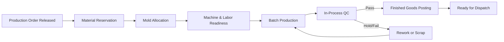
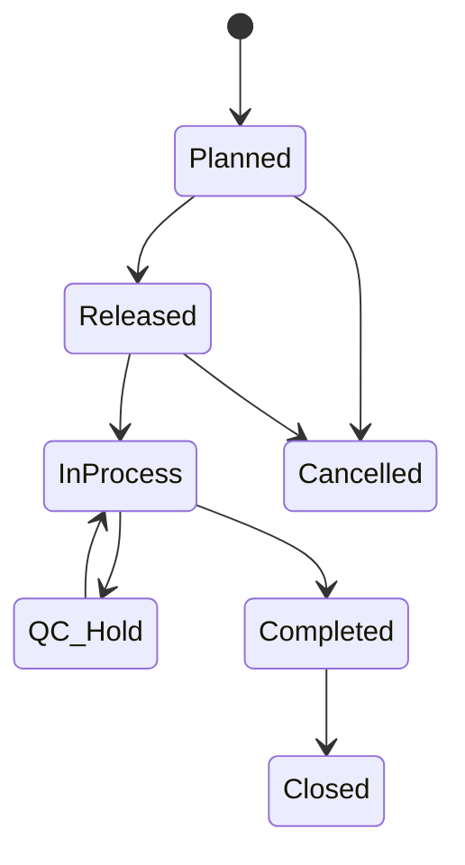
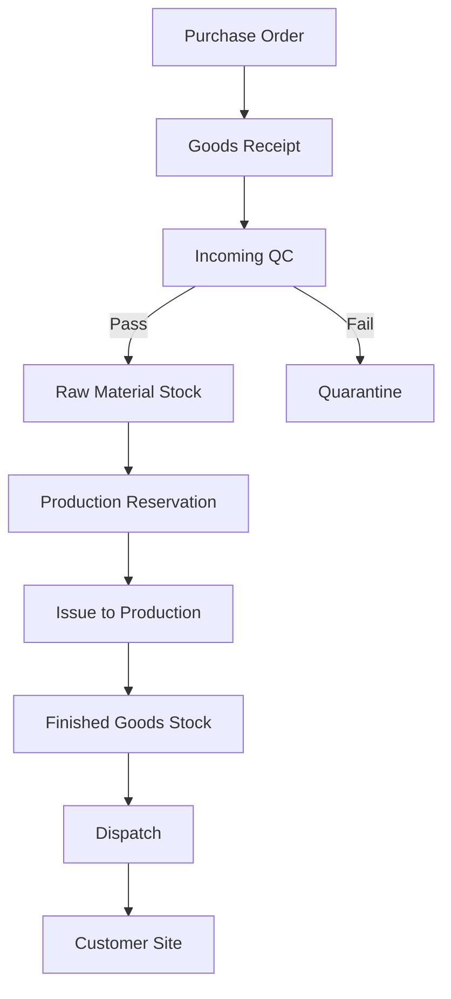
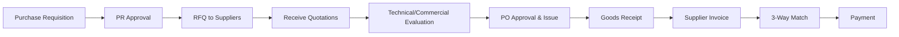
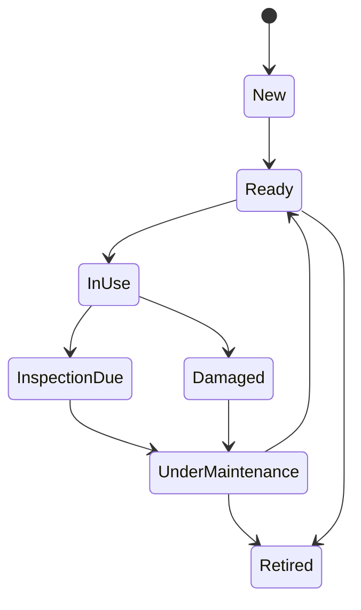
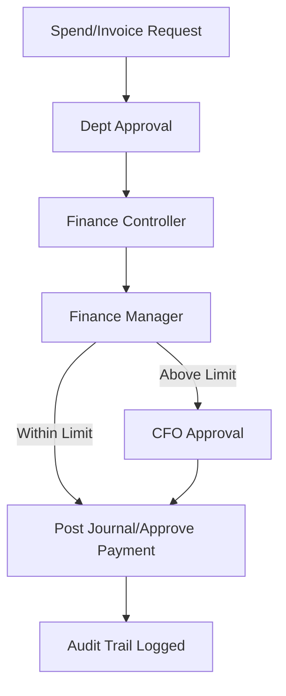
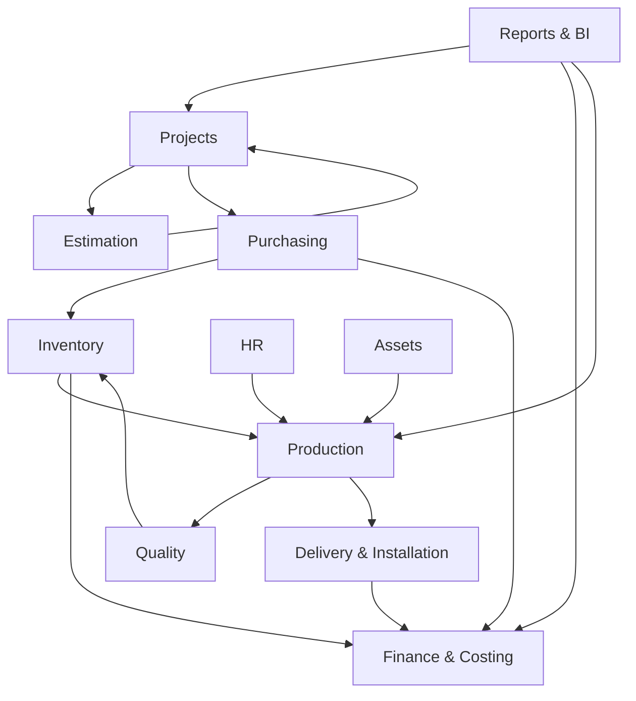

# Complete Workflow Analysis — ERP لنظام مصنع خرسانة ومنتجات أسمنتية
**الإصدار:** 1.0  
**النطاق:** Enterprise-Level / Production-Ready  
**التقنيات المستهدفة:**  
- Backend: ASP.NET Core Web API  
- Frontend: React.js + Tailwind CSS  
- Database: SQL Server  
- ORM: Entity Framework Core  

---

## 1) نظرة عامة على النظام (System Overview)

هذا النظام ERP مخصص لإدارة دورة العمل الكاملة لمصنع الخرسانة والمنتجات الأسمنتية من **طلب العميل** حتى **إقفال المشروع ماليًا** وإصدار **تقارير الأداء والربحية**.  
يركّز على التكامل بين العمليات التشغيلية (المخزون، الإنتاج، الجودة، التوريد) والعمليات الإدارية (المشاريع، المشتريات، الموارد، الحسابات).

### أهداف النظام العليا
1. توحيد البيانات عبر الموديولات.
2. تسريع دورات الاعتماد والتنفيذ.
3. خفض الهدر في المواد والزمن.
4. تحسين دقة التكلفة والربحية.
5. دعم قرارات الإدارة عبر تقارير لحظية.

---

## 2) الموديولات التفصيلية

---

# 2.1 إدارة المشاريع (Project Management)

## 1. شرح الموديول
مسؤول عن إنشاء المشروع، تعريف نطاقه، الجدولة، متابعة التقدم، وربطه بالتكاليف والإنتاج والتوريد.

## 2. أهداف الموديول
- توثيق كامل لبيانات المشروع.
- ضبط المراحل الزمنية والتنفيذية.
- ربط المشروع مع المقايسة والإنتاج والمصروفات.

## 3. المستخدمون (Actors)
- Project Manager  
- Planning Engineer  
- Operations Manager  
- Finance Controller  
- Executive Management

## 4. المدخلات
- طلب العميل
- العقد/أمر الإسناد
- بنود العمل والكميات
- المواقع والمواعيد

## 5. المخرجات
- Project Charter
- خطة التنفيذ
- خط الأساس للمدة والتكلفة
- مؤشرات الإنجاز والتأخير

## 6. Workflow خطوة بخطوة
1. تسجيل Lead/Opportunity.
2. تحويله إلى مشروع بعد فوز العرض.
3. تعريف WBS (بنود/أنشطة).
4. تحديد الخطة الزمنية (Baseline).
5. ربط الموارد (طاقم، معدات، قوالب).
6. متابعة الإنجاز الدوري.
7. إدارة التغييرات (Variation Orders).
8. إغلاق المشروع تشغيليًا وماليًا.

## 7. حالات الخطأ والتحقق
- منع اعتماد المشروع بدون عقد/عميل.
- منع البدء الإنتاجي قبل اعتماد المقايسة.
- تنبيه إذا تجاوزت التكاليف Baseline.

## 8. Business Rules
- لا يمكن فتح أمر إنتاج لمشروع غير معتمد.
- أي تعديل نطاق > نسبة معينة يحتاج موافقة الإدارة.

## 9. الجداول المرتبطة
- Projects, ProjectPhases, ProjectWBS, ProjectSchedules
- ProjectResources, ProjectVariations, ProjectStatusHistory

## 10. API المطلوبة
- `POST /api/projects`
- `PUT /api/projects/{id}/approve`
- `GET /api/projects/{id}/dashboard`
- `POST /api/projects/{id}/variations`

## 11. الإشعارات والموافقات
- إشعار اعتماد المشروع للعمليات والمالية.
- موافقات التغيير: PM → Finance → Director.

## 12. دورة الحالات
`Draft → UnderReview → Approved → InExecution → OnHold → Completed → Closed`

## 13. الارتباط بباقي الموديولات
المشاريع مركز الربط مع: التسعير، الإنتاج، المشتريات، التوريد، الحسابات.

## 14. المشاكل المتوقعة
- نقص بيانات العقد.
- تغييرات عميل متكررة.
- تضارب الموارد بين مشاريع متعددة.

## 15. فرص الأتمتة
- تنبيه ذكي للتأخير المتوقع.
- Auto-Rebaseline عند approved variation.

---

# 2.2 التسعير والمقايسات (Estimation & Pricing)

## 1. شرح الموديول
يبني عرض السعر بناءً على الكميات، الخلطات، القوالب، الإنتاج، النقل، التركيب، والهامش الربحي.

## 2. أهداف
- تسعير دقيق وسريع.
- ربط التسعير بالواقع التشغيلي.
- حساب سيناريوهات متعددة.

## 3. المستخدمون
- Estimation Engineer
- Sales Manager
- Finance Analyst

## 4. المدخلات
- BOQ
- مواصفات فنية
- أسعار مواد خام
- تكاليف تشغيل ونقل

## 5. المخرجات
- Quotation
- Cost Breakdown
- Margin Analysis

## 6. Workflow
1. استلام RFQ.
2. إدخال الكميات/المواصفات.
3. اختيار الخلطات والقوالب المناسبة.
4. احتساب مواد + عمالة + معدات + نقل + تركيب.
5. تطبيق هامش وربما خصومات.
6. مراجعة واعتماد داخلي.
7. إصدار العرض.

## 7. Validation
- رفض عرض بدون ربط BOQ.
- رفض هامش أقل من الحد الأدنى.

## 8. Business Rules
- تحديث أسعار المواد تلقائيًا من آخر Price List مع تاريخ صلاحية.
- عروض تتجاوز سقف الخصم تتطلب موافقة مدير مبيعات.

## 9. الجداول
- Quotations, QuotationLines, CostElements, PriceLists, MarginPolicies

## 10. APIs
- `POST /api/quotations/calculate`
- `POST /api/quotations`
- `PUT /api/quotations/{id}/approve`
- `POST /api/quotations/{id}/convert-to-project`

## 11. الإشعارات
- إشعار انتهاء صلاحية العرض.
- إشعار طلب خصم استثنائي.

## 12. Status Lifecycle
`Draft → Calculated → UnderApproval → Approved → Sent → Won/Lost → Archived`

## 13. الارتباط
يتغذى من: المخزون/الخلطات/القوالب/الأجور.  
ويرسل إلى: المشاريع، المالية.

## 14. المشاكل المتوقعة
- تذبذب أسعار المواد.
- مواصفات ناقصة من العميل.

## 15. الأتمتة
- Recommendation Engine لاختيار أفضل خلطة/قالب تكلفةً.
- Auto-escalation لعروض غير معتمدة > 48 ساعة.

---

# 2.3 إدارة القوالب (Mold Management)

## 1. شرح
إدارة دورة حياة القوالب من التصنيع/الاستلام حتى التشغيل والصيانة والتقاعد.

## 2. أهداف
- رفع جاهزية القوالب.
- تقليل الأعطال.
- تتبع تكلفة القالب لكل منتج.

## 3. المستخدمون
- Mold Supervisor
- Maintenance Engineer
- Production Planner

## 4. المدخلات
- نوع المنتج
- خطة إنتاج
- سجل القالب (العمر/الاستخدام)

## 5. المخرجات
- خطة توزيع القوالب
- أوامر صيانة
- تقارير العمر التشغيلي

## 6. Workflow
1. تسجيل القالب (Master Data).
2. تحديد السعة والاستخدام المسموح.
3. تخصيص القالب لأوامر إنتاج.
4. فحص قبل التشغيل.
5. تحديث عداد الاستخدام.
6. Trigger صيانة دورية.
7. إعادة تأهيل/إحالة للتقاعد.

## 7. Validation
- منع تخصيص قالب غير جاهز.
- منع تجاوز الاستخدام الأقصى بدون صيانة.

## 8. Business Rules
- كل X دورات تشغيل = فحص إلزامي.
- قالب متضرر = Blocked تلقائيًا.

## 9. الجداول
- Molds, MoldUsageLogs, MoldMaintenance, MoldAssignments, MoldStatusHistory

## 10. APIs
- `POST /api/molds`
- `POST /api/molds/{id}/assign`
- `POST /api/molds/{id}/inspection`
- `POST /api/molds/{id}/maintenance`

## 11. الإشعارات
- إنذار قرب بلوغ حد التشغيل.
- إشعار صيانة مستحقة.

## 12. Lifecycle
`New → Ready → InUse → MaintenanceDue → UnderMaintenance → Ready → Retired`

## 13. الارتباط
مرتبط بالإنتاج، الجودة، الصيانة، التكلفة.

## 14. المشاكل
- تعارض تخصيص قالب لنفس الفترة.
- تلف مفاجئ أثناء الإنتاج.

## 15. الأتمتة
- جدولة صيانة تنبؤية عبر معدلات الأعطال.

---

# 2.4 تصميم الخلطات (Mix Design)

## 1. شرح
إدارة وصفات الخلط، النسخ المعتمدة، وربطها بالمنتجات والأوامر الإنتاجية.

## 2. أهداف
- الالتزام بالمواصفات الفنية.
- التحكم بتكلفة المواد.
- توحيد جودة المنتج.

## 3. المستخدمون
- Lab Engineer
- QC Manager
- Production Engineer

## 4. المدخلات
- مقاومة مطلوبة
- نوع الأسمنت/الركام
- متطلبات العميل/المشروع

## 5. المخرجات
- Mix Version معتمدة
- BOM مواد للدفعة
- تقارير أداء الخلطة

## 6. Workflow
1. إنشاء خلطة أولية.
2. اختبار معملي.
3. تحليل نتائج.
4. تحسين النسب.
5. اعتماد إصدار الخلطة.
6. ربطها بمنتجات/مشاريع.
7. استخدام الإنتاج للإصدار الفعال فقط.

## 7. Validation
- منع استخدام خلطة غير معتمدة.
- منع تعديل إصدار مستخدم إلا عبر Versioning.

## 8. Rules
- Mix revision mandatory عند تغيير مادة رئيسية.
- موافقة QC + Technical Manager للإصدارات الجديدة.

## 9. الجداول
- MixDesigns, MixVersions, MixComponents, MixTestResults, MixApprovals

## 10. APIs
- `POST /api/mixes`
- `POST /api/mixes/{id}/tests`
- `PUT /api/mixes/{id}/approve`
- `GET /api/mixes/active`

## 11. الإشعارات
- فشل اختبارات → تنبيه عاجل.
- انتهاء صلاحية خلطة.

## 12. Lifecycle
`Draft → Testing → Revision → Approved → Active → Suspended → Obsolete`

## 13. الارتباط
الإنتاج، الجودة، المخزون، التسعير.

## 14. المشاكل
- تفاوت جودة المواد الخام.
- تضارب خلطة مع متطلبات مناخية.

## 15. الأتمتة
- اقتراح تعديل نسب حسب نتائج الاختبارات التاريخية.

---

# 2.5 إدارة المخزون (Inventory Management)

## 1. شرح
يتابع كل الحركات: استلام، صرف، تحويل، جرد، مرتجع، وحجز كميات للإنتاج.

## 2. أهداف
- توافر المواد في الوقت المناسب.
- خفض نفاد/تكدس المخزون.
- تتبع دقيق للكميات والقيم.

## 3. المستخدمون
- Store Keeper
- Inventory Controller
- Production Planner
- Procurement

## 4. المدخلات
- GRN, Issue Notes
- Purchase Receipts
- Production Reservations

## 5. المخرجات
- Stock On Hand
- Reorder Alerts
- Inventory Valuation

## 6. Workflow
1. تعريف الأصناف والمخازن.
2. استلام مواد مع فحص جودة.
3. إدخال مواقع التخزين.
4. حجز كميات لأوامر إنتاج.
5. صرف تلقائي/يدوي.
6. جرد دوري وتسويات.
7. تتبع صلاحية/تشغيلة.

## 7. Validation
- منع رصيد سالب.
- منع استلام بدون PO/Approval.
- إلزام Batch/Lot للمواد الحرجة.

## 8. Rules
- FEFO/FIFO حسب نوع المادة.
- حد إعادة الطلب + Safety Stock إلزامي للأصناف A.

## 9. الجداول
- Items, Warehouses, Bins, StockBalances, StockTransactions, Reservations, CycleCounts

## 10. APIs
- `POST /api/inventory/receipts`
- `POST /api/inventory/issues`
- `POST /api/inventory/reservations`
- `POST /api/inventory/adjustments`

## 11. الإشعارات
- Near-Reorder
- Expiry Alerts
- Negative stock attempt alert

## 12. Lifecycle (للحركة)
`Draft → Posted → Reversed/Cancelled`

## 13. الارتباط
المشتريات، الإنتاج، الجودة، الحسابات.

## 14. المشاكل
- اختلاف فعلي/دفترى.
- تأخر توريد يسبب shortage.

## 15. الأتمتة
- Auto-PR عند انخفاض المخزون أسفل الحد.
- Auto-allocation للأوامر حسب الأولوية.

---

# 2.6 المشتريات (Purchasing)

## 1. شرح
يدير طلبات الشراء، عروض الموردين، أوامر الشراء، والاستلام وربط الفواتير.

## 2. أهداف
- أفضل سعر/جودة/زمن.
- ضبط الاعتماد المالي قبل الالتزام.
- تقليل مخاطر المورد.

## 3. المستخدمون
- Procurement Officer
- Procurement Manager
- Finance Approver
- Supplier (Portal)

## 4. المدخلات
- Purchase Requisition
- مواصفات وكميات
- قائمة موردين

## 5. المخرجات
- RFQ, Bid Comparison
- Purchase Orders
- Supplier Performance

## 6. Workflow
1. إنشاء PR (يدوي/تلقائي من المخزون).
2. اعتماد PR.
3. إرسال RFQ لعدة موردين.
4. استقبال العروض.
5. تحليل وعمل Comparison Matrix.
6. اعتماد فني ومالي.
7. إصدار PO.
8. متابعة التسليم.
9. استلام وفحص.
10. مطابقة 3-way (PO/GRN/Invoice).

## 7. Validation
- منع PO بدون PR معتمد.
- منع تجاوز Budget بدون موافقة استثنائية.

## 8. Rules
- الشراء فوق حد معين يتطلب 3 عروض.
- مورد غير مؤهل = ممنوع الشراء.

## 9. الجداول
- PurchaseRequisitions, RFQs, SupplierQuotes, PurchaseOrders, GoodsReceipts, APInvoiceMatch

## 10. APIs
- `POST /api/procurement/requisitions`
- `POST /api/procurement/rfqs`
- `POST /api/procurement/pos`
- `POST /api/procurement/receipts`

## 11. الإشعارات
- Pending approvals
- PO delayed delivery
- Invoice mismatch

## 12. Lifecycle
`PR: Draft→Approved→Converted`  
`PO: Draft→Approved→Issued→PartiallyReceived→Closed`

## 13. الارتباط
المخزون، الحسابات الدائنة، المشاريع، الجودة.

## 14. المشاكل
- تأخير المورد.
- اختلاف جودة المواد المستلمة.

## 15. الأتمتة
- Supplier auto-ranking.
- Auto-reminder للمورد قبل تاريخ التسليم.

---

# 2.7 إدارة الإنتاج (Production Management)

## 1. شرح
تخطيط وجدولة وتنفيذ أوامر الإنتاج ومتابعة الاستهلاك والمخرجات.

## 2. أهداف
- إنتاج وفق الخطة والجودة.
- تعظيم الاستفادة من الطاقات.
- تقليل الهدر والتوقفات.

## 3. المستخدمون
- Production Planner
- Plant Supervisor
- Operators
- Maintenance Team

## 4. المدخلات
- أوامر مشاريع
- Mix Design
- قوالب جاهزة
- مواد محجوزة

## 5. المخرجات
- Finished/Semi-finished Goods
- Consumption Logs
- OEE/KPI Reports

## 6. Workflow
1. إصدار Production Order.
2. Scheduling على الخطوط والقوالب.
3. Pre-check جاهزية (مواد/قوالب/معدات/عمالة).
4. بدء الدفعة.
5. تسجيل الاستهلاك الفعلي.
6. تسجيل الإنتاج والكميات المرفوضة.
7. تحويل الجودة للفحص.
8. ترحيل للمخزون أو إعادة تشغيل.

## 7. Validation
- منع بدء أمر بدون release من الجودة والمخزون.
- منع إقفال أمر مع استهلاك غير متوازن.

## 8. Rules
- Scrap > threshold يتطلب Root Cause.
- توقّف خط > X دقيقة يولّد incident.

## 9. الجداول
- ProductionOrders, ProductionOperations, WorkCenters, ProductionConsumptions, ProductionOutputs, DowntimeLogs

## 10. APIs
- `POST /api/production/orders`
- `POST /api/production/orders/{id}/release`
- `POST /api/production/orders/{id}/report-consumption`
- `POST /api/production/orders/{id}/close`

## 11. الإشعارات
- Machine downtime
- Material shortage during run
- QC hold on batch

## 12. Lifecycle
`Planned → Released → InProcess → QC_Hold/Completed → Closed/Cancelled`

## 13. الارتباط
المخزون، الخلطات، القوالب، الجودة، الصيانة، التكاليف.

## 14. المشاكل
- توقف معدات.
- نقص مواد مفاجئ.
- رفض جودة عالٍ.

## 15. الأتمتة
- Auto-reschedule عند downtime.
- Auto-consumption posting عبر IoT/PLC integration.

---

# 2.8 مراقبة الجودة (Quality Control)

## 1. شرح
فحوصات المواد الداخلة، أثناء الإنتاج، وبعد الإنتاج/قبل الشحن.

## 2. أهداف
- ضمان المطابقة للمواصفات.
- تقليل المرتجعات والشكاوى.
- توثيق جودة قابل للتدقيق.

## 3. المستخدمون
- QC Inspector
- Lab Technician
- QC Manager

## 4. المدخلات
- عينات مواد خام
- عينات إنتاج
- معايير قبول

## 5. المخرجات
- شهادات فحص
- NCR/CAPA
- Release/Hold Decisions

## 6. Workflow
1. إنشاء خطة فحص (IQC/IPQC/OQC).
2. سحب عينات.
3. تنفيذ اختبارات.
4. تسجيل النتائج.
5. اتخاذ القرار (Pass/Hold/Reject).
6. فتح NCR إذا فشل.
7. متابعة CAPA والإغلاق.

## 7. Validation
- منع شحن batch بدون QC release.
- إلزام سبب الرفض.

## 8. Rules
- فشل اختبار حرج = Block batch كامل.
- إعادة اختبار وفق policy محددة فقط.

## 9. الجداول
- QCPlans, QCTests, QCResults, NCRs, CAPAs, BatchRelease

## 10. APIs
- `POST /api/qc/tests`
- `POST /api/qc/results`
- `POST /api/qc/ncr`
- `PUT /api/qc/batches/{id}/release`

## 11. الإشعارات
- Critical failure alert.
- CAPA overdue.

## 12. Lifecycle
`Scheduled → Sampled → Tested → Pass/Hold/Reject → Closed`

## 13. الارتباط
المشتريات (مواد خام)، الإنتاج، المخزون، التوريد.

## 14. المشاكل
- تأخر نتائج المختبر.
- تكرار رفض لنفس السبب.

## 15. الأتمتة
- Auto-block inventory batch عند fail.
- Trend alerts لانحراف الجودة.

---

# 2.9 التوريد والتركيب (Logistics, Delivery & Installation)

## 1. شرح
تخطيط الشحن، إصدار أوامر التحميل، التسليم للموقع، والتركيب والتشطيبات.

## 2. أهداف
- تسليم في الموعد.
- تقليل مرتجعات النقل.
- توثيق استلام العميل.

## 3. المستخدمون
- Logistics Coordinator
- Fleet Supervisor
- Site Engineer
- Client Representative

## 4. المدخلات
- Ready-to-ship list
- Delivery Schedule
- Site constraints

## 5. المخرجات
- Delivery Notes
- POD (Proof of Delivery)
- Installation Completion Reports

## 6. Workflow
1. إنشاء خطة توريد بحسب أولويات المشروع.
2. حجز مركبات وسائقين.
3. تحميل وتأكيد كميات.
4. شحن وتتبع.
5. تسليم بالموقع وتوقيع.
6. تنفيذ التركيب.
7. معالجة العيوب/النواقص.

## 7. Validation
- منع شحن مواد غير released من QC.
- منع إغلاق رحلة بدون POD.

## 8. Rules
- أي ضرر بالنقل يفتح claim.
- تركيب يتطلب check-list سلامة قبل البدء.

## 9. الجداول
- DeliveryPlans, DispatchOrders, ShipmentLoads, PODs, InstallationTasks, SiteIssues

## 10. APIs
- `POST /api/logistics/dispatch`
- `POST /api/logistics/shipments/{id}/pod`
- `POST /api/installation/tasks`
- `POST /api/installation/issues`

## 11. الإشعارات
- ETA alerts
- Delay notifications
- Site issue escalation

## 12. Lifecycle
`Planned → Dispatched → InTransit → Delivered → Installed → SignedOff/Closed`

## 13. الارتباط
المخزون، الجودة، المشاريع، الحسابات.

## 14. المشاكل
- تأخير مرور/طرق.
- موقع غير جاهز.
- تلف أثناء النقل.

## 15. الأتمتة
- Dynamic route optimization.
- Auto-invoice trigger بعد POD + Signoff.

---

# 2.10 الحسابات والتكاليف (Financial Accounting & Costing)

## 1. شرح
يمسك القيود اليومية، AP/AR، مراكز التكلفة، تكاليف المشاريع، الربحية.

## 2. أهداف
- تسجيل مالي دقيق ومتوافق.
- تكلفة فعلية لحظية لكل مشروع/منتج.
- دعم التحليل والقرار.

## 3. المستخدمون
- Accountant
- Cost Accountant
- Finance Manager
- Auditor

## 4. المدخلات
- PO/GRN/Invoices
- Production consumption
- Payroll allocation
- Delivery/install costs

## 5. المخرجات
- GL Journals
- AP/AR Aging
- Project P&L
- Cost Variance Reports

## 6. Workflow
1. ترحيل قيود تلقائية من العمليات.
2. مطابقة فواتير الموردين.
3. تسجيل فواتير العملاء.
4. تسويات شهرية.
5. إقفال تكاليف الأوامر والمشاريع.
6. إصدار القوائم والتقارير.

## 7. Validation
- منع ترحيل دون account mapping.
- منع تعديل فترة مالية مغلقة.

## 8. Rules
- 3-way match إلزامي للدفع.
- أي قيد يدوي كبير يتطلب موافقة.

## 9. الجداول
- GLAccounts, JournalEntries, APInvoices, ARInvoices, Payments, CostCenters, ProjectCostLedger

## 10. APIs
- `POST /api/finance/journals/post`
- `POST /api/finance/ap/invoices`
- `POST /api/finance/ar/invoices`
- `GET /api/finance/projects/{id}/pnl`

## 11. الإشعارات
- Overdue receivables
- Budget overrun
- Approval pending for payment

## 12. Lifecycle
`Draft → Validated → Posted → Reconciled → Closed`

## 13. الارتباط
كل الموديولات التشغيلية تصب في المالية.

## 14. المشاكل
- mismatch بين الفعلي والنظري.
- تأخر مستندات داعمة.

## 15. الأتمتة
- Auto-journal generation.
- Auto-accrual at period end.

---

# 2.11 إدارة الموظفين (HR Management)

## 1. شرح
إدارة الهيكل الوظيفي، التعيين، الجداول، الحضور، التكليف، وربط تكلفة العمالة بالمشاريع.

## 2. أهداف
- توزيع فعّال للعمالة.
- متابعة الامتثال والمهارات.
- دقة تكلفة العمالة.

## 3. المستخدمون
- HR Officer
- HR Manager
- Site/Plant Supervisors

## 4. المدخلات
- بيانات الموظفين
- الشفتات
- طلبات الموارد البشرية

## 5. المخرجات
- Rosters
- Attendance
- Labor cost allocation

## 6. Workflow
1. تعريف الوظائف/الدرجات.
2. تعيين/ربط مهارات.
3. جدولة الشفتات.
4. تسجيل الحضور.
5. تخصيص لمشاريع/أوامر إنتاج.
6. ترحيل تكلفة العمالة.

## 7. Validation
- منع تكليف موظف غير مؤهل للعملية.
- منع تجاوز ساعات العمل النظامية دون اعتماد.

## 8. Rules
- مهام حرجة تتطلب Certification صالح.
- OT approvals multi-level.

## 9. الجداول
- Employees, Skills, Shifts, Attendance, Assignments, PayrollAllocations

## 10. APIs
- `POST /api/hr/employees`
- `POST /api/hr/assignments`
- `POST /api/hr/attendance`
- `GET /api/hr/utilization`

## 11. الإشعارات
- Expiring certificates
- Shift conflicts

## 12. Lifecycle
`Active → OnLeave → Suspended → Terminated`

## 13. الارتباط
الإنتاج، المشاريع، التكاليف.

## 14. المشاكل
- عجز عمالة بمهارات معينة.
- ارتفاع الغياب.

## 15. الأتمتة
- Smart shift planning بناءً على workload.

---

# 2.12 إدارة المعدات (Assets & Equipment)

## 1. شرح
إدارة أصول المصنع والمركبات والمعدات، التشغيل، الأعطال، الصيانة الوقائية والتصحيحية.

## 2. أهداف
- تقليل downtime.
- رفع عمر الأصول.
- دقة تكلفة التشغيل.

## 3. المستخدمون
- Maintenance Manager
- Technicians
- Fleet Manager
- Production Supervisor

## 4. المدخلات
- Asset master
- PM schedules
- Breakdown reports

## 5. المخرجات
- Work Orders
- Uptime reports
- Maintenance costs

## 6. Workflow
1. تسجيل الأصل.
2. إنشاء خطة صيانة وقائية.
3. تنفيذ PM.
4. استقبال بلاغ عطل.
5. إصدار corrective WO.
6. إغلاق وإدراج التكلفة.

## 7. Validation
- منع تشغيل معدة blocked.
- إلزام root cause للأعطال المتكررة.

## 8. Rules
- PM overdue = equipment risk flag.
- Spare parts issue requires WO reference.

## 9. الجداول
- Assets, MaintenancePlans, WorkOrders, BreakdownLogs, SparePartsUsage

## 10. APIs
- `POST /api/assets`
- `POST /api/maintenance/workorders`
- `PUT /api/maintenance/workorders/{id}/close`
- `GET /api/assets/{id}/health`

## 11. الإشعارات
- PM due alerts
- Critical breakdown escalation

## 12. Lifecycle
`Available → InUse → UnderMaintenance → Available → Retired`

## 13. الارتباط
الإنتاج، المخزون (spares)، التكاليف، HR (فنيين).

## 14. المشاكل
- نقص قطع غيار.
- أعطال متكررة لخط إنتاج.

## 15. الأتمتة
- Predictive maintenance based on sensor/runtime data.

---

# 2.13 التقارير والتحليلات (Reports & BI)

## 1. شرح
لوحات قيادة وتقارير تشغيلية/مالية/إدارية لحظية وتاريخية.

## 2. أهداف
- رؤية موحدة للأداء.
- دعم القرار السريع.
- تتبع KPI وSLA.

## 3. المستخدمون
- Management
- PMO
- Finance
- Operations

## 4. المدخلات
- بيانات كل الموديولات
- KPI definitions

## 5. المخرجات
- Executive dashboards
- Variance analysis
- Profitability reports

## 6. Workflow
1. ETL/Views تجميعية.
2. حساب المؤشرات.
3. نشر dashboards.
4. جدولة التقارير.
5. تنبيهات performance anomalies.

## 7. Validation
- Data freshness checks.
- reconciliation مع GL totals.

## 8. Rules
- KPI definitions versioned.
- صلاحيات عرض حسب الدور.

## 9. الجداول
- FactProduction, FactCost, FactInventory, DimProject, DimTime, KPIResults

## 10. APIs
- `GET /api/bi/dashboard/executive`
- `GET /api/bi/reports/project-profitability`
- `GET /api/bi/kpis/production`

## 11. الإشعارات
- KPI breach alerts
- Weekly summary digest

## 12. Lifecycle
`Generated → Reviewed → Published → Archived`

## 13. الارتباط
يقرأ من جميع الموديولات.

## 14. المشاكل
- تفاوت التعريفات بين الأقسام.
- تأخير تحديث البيانات.

## 15. الأتمتة
- Automated narrative insights.
- Forecasting للطلب والتكاليف.

---

## 3) Workflow موحد ونهائي للنظام بالكامل

### التسلسل الشامل
`طلب العميل → التسعير → اعتماد المشروع → المشتريات → المخزون → الإنتاج → الجودة → التوريد → الحسابات → التقارير`

### خطوات تفصيلية
1. **استقبال طلب العميل** وتسجيل المتطلبات.
2. **المقايسة والتسعير** مع سيناريوهات تكلفة وهامش.
3. **اعتماد عرض السعر** وإرساله للعميل.
4. عند الفوز: **إنشاء مشروع** وتعريف WBS وجدول التنفيذ.
5. **تخطيط الموارد** (قوالب، عمالة، معدات).
6. **MRP/PR تلقائي** للمواد الناقصة.
7. **دورة مشتريات كاملة** (RFQ → PO → استلام).
8. **فحص الجودة للمواد الداخلة** ثم إدخال المخزون.
9. **إصدار أوامر إنتاج** وربط الخلطات والقوالب.
10. **تنفيذ الإنتاج** وتسجيل الاستهلاك والهدر.
11. **فحص الجودة للإنتاج** (Pass/Hold/Reject).
12. **ترحيل المنتج الجاهز للمخزون**.
13. **التخطيط اللوجستي والتوريد** للموقع.
14. **التركيب والتشطيب** وإغلاق مهام الموقع.
15. **القيود المالية التلقائية** (مواد/أجور/نقل/إيراد).
16. **مطابقة الفواتير والتحصيل/الدفع**.
17. **إقفال المشروع** (تشغيلي + مالي).
18. **التقارير النهائية** للربحية والأداء والدروس المستفادة.

### الاعتمادات المطلوبة
- اعتماد عرض السعر.
- اعتماد المشروع.
- اعتماد PR/PO.
- اعتماد release أمر الإنتاج.
- اعتماد QC release.
- اعتماد فواتير ودفع.
- اعتماد closing.

### معالجة الأخطاء والاستثناءات
- نقص مواد: auto substitute policy أو expedite PO.
- فشل جودة: quarantine + rework/scrap + CAPA.
- توقف معدات: replan + WO عاجل.
- تأخر توريد: reschedule الموقع وإشعار العميل.
- تجاوز تكلفة: escalation وموافقة تعديل budget.

---

## 4) Mermaid Diagrams

### 4.1 Workflow الإنتاج


### 4.2 دورة حياة أمر الإنتاج


### 4.3 حركة المخزون


### 4.4 دورة المشتريات


### 4.5 دورة المشروع


### 4.6 دورة صيانة القوالب


### 4.7 دورة الموافقات المالية


### 4.8 العلاقات بين الموديولات


---

## 5) Use Cases (مختصر شامل)

1. **إنشاء عرض سعر**: Estimator ينشئ/يحسب/يعتمد/يرسل.
2. **تحويل عرض رابح لمشروع**: Sales + PM.
3. **طلب شراء تلقائي من انخفاض مخزون**: Inventory → Procurement.
4. **إصدار أمر إنتاج**: Planner بعد readiness checks.
5. **فحص جودة دفعة**: QC يمرر أو يحجز أو يرفض.
6. **توريد وتركيب بالموقع**: Logistics + Site Team.
7. **ترحيل مالي تلقائي**: Integration Service.
8. **إغلاق مشروع**: PM + Finance + Management.

---

## 6) Business Rules كاملة (Core Set)

1. لا إنتاج بدون Project Approved + Mix Approved + Mold Ready + Material Reserved.  
2. لا شحن بدون QC Release.  
3. لا دفع مورد بدون 3-Way Match.  
4. لا تعديل على فترات مالية مغلقة.  
5. أي انحراف تكلفة > Threshold يحتاج Approval.  
6. أي Scrap مرتفع يستدعي NCR وCAPA.  
7. إلزام Audit Trail لكل موافقة/رفض/تعديل.  
8. صلاحيات Role-Based + Scope-Based (Project/Plant/Warehouse).  
9. Master Data governance (items, mixes, molds) عبر workflow اعتماد.  
10. كل تكاليف التشغيل تُحمّل على Cost Centers/Projects بشكل يومي.

---

## 7) Roles & Permissions Matrix

| Role | Projects | Estimation | Procurement | Inventory | Production | QC | Finance | Reports |
|---|---|---|---|---|---|---|---|---|
| Sales Manager | R | C/A | - | - | - | - | - | R |
| Project Manager | C/A | R | R | R | R | R | R | C |
| Procurement Officer | - | - | C | R | - | - | - | R |
| Store Keeper | - | - | R | C/A | R | - | - | R |
| Production Planner | R | R | - | R | C/A | R | - | R |
| QC Manager | - | - | R | R | R | C/A | - | C |
| Accountant | R | R | R | R | R | R | C/A | C |
| Executive | A | A | A | A | A | A | A | A |

> C = Create/Update, R = Read, A = Approve/Admin

---

## 8) Dependencies بين الموديولات

- Projects يعتمد على Estimation للفوز.
- Production يعتمد على Inventory + Mold + Mix + HR + Assets.
- Delivery يعتمد على QC + Inventory + Project schedule.
- Finance يعتمد على كل المعاملات المرحّلة من الموديولات.
- BI يعتمد على Data Warehouse/Views موحدة.

---

## 9) System Architecture Overview

### نمط معماري مقترح
- **Domain-oriented Modular Monolith** كبداية (أو Microservices تدريجيًا).
- طبقات:
  - API Layer (ASP.NET Core Controllers)
  - Application Layer (Use Cases, CQRS)
  - Domain Layer (Entities, Aggregates, Policies)
  - Infrastructure Layer (EF Core, SQL Server, Messaging)
- Integration:
  - Event Bus (RabbitMQ/Azure Service Bus) للأحداث الحرجة.
  - Background Jobs (Hangfire/Quartz) للمهام المجدولة.

### Non-Functional
- Multi-tenant readiness (اختياري)
- Audit & Compliance
- High availability
- Backup/DR

---

## 10) تقسيم الميكروسيرفس/الموديولات المقترح

1. `ProjectService`
2. `EstimationService`
3. `ProcurementService`
4. `InventoryService`
5. `ProductionService`
6. `QualityService`
7. `LogisticsService`
8. `FinanceService`
9. `HRService`
10. `AssetService`
11. `ReportingService`
12. `IdentityService`

> يمكن البدء بـ Modular Monolith ثم استخراج الخدمات الأعلى حملًا (Production, Inventory, Finance) أولاً.

---

## 11) هيكلة APIs المقترحة

### مثال Standard REST + Versioning
- `/api/v1/projects`
- `/api/v1/quotations`
- `/api/v1/procurement/requisitions`
- `/api/v1/inventory/transactions`
- `/api/v1/production/orders`
- `/api/v1/qc/tests`
- `/api/v1/logistics/dispatches`
- `/api/v1/finance/journals`
- `/api/v1/reports/kpis`

### معايير
- JWT + RBAC
- Idempotency-Key لعمليات الإنشاء الحساسة
- Correlation-Id للتتبع
- Pagination/Filtering/Sorting موحّد
- Outbox pattern للأحداث

---

## 12) هيكلة مجلدات Backend وFrontend

### Backend (ASP.NET Core + EF Core)
```text
src/
  BuildingBlocks/
    Common/
    Contracts/
    EventBus/
  Services/
    ProjectService/
      Api/
      Application/
      Domain/
      Infrastructure/
    EstimationService/
    ProcurementService/
    InventoryService/
    ProductionService/
    QualityService/
    LogisticsService/
    FinanceService/
    HRService/
    AssetService/
    ReportingService/
  Gateway/
  Identity/
tests/
  UnitTests/
  IntegrationTests/
```

### Frontend (React + Tailwind)
```text
web/
  src/
    app/
      routes/
      store/
    modules/
      projects/
      estimation/
      procurement/
      inventory/
      production/
      quality/
      logistics/
      finance/
      hr/
      assets/
      reports/
    components/
      ui/
      charts/
      forms/
    services/
      apiClient/
      auth/
    hooks/
    utils/
    styles/
  public/
```

---

## 13) توصيات تشغيل Production-Ready

1. **Master Data Governance** صارم.
2. **SLA approvals** لكل مرحلة.
3. **Observability** (Logs, Metrics, Traces).
4. **Feature Flags** لتفعيل وحدات تدريجيًا.
5. **Data Quality Rules** قبل BI.
6. **Disaster Recovery** واختبارات دورية.
7. **Security baseline**: least privilege + encryption at rest/in transit.

---

## 14) خاتمة تنفيذية

هذا التصميم يوفّر Workflow متكامل يغطي دورة حياة العملية الصناعية والمالية بالكامل داخل مصنع الخرسانة والمنتجات الأسمنتية، مع:
- اعتماد متعدد المستويات،
- تتبع مخزون وتكاليف لحظي،
- ضبط جودة شامل،
- ربط عمليات الموقع بالتصنيع،
- تقارير قيادية تدعم القرار.

الوثيقة جاهزة كأساس لتفصيل **BRD/SRS**, تصميم قاعدة البيانات الفعلي، وبناء Backlog التنفيذ (Epics/Stories) على مستوى Enterprise.
