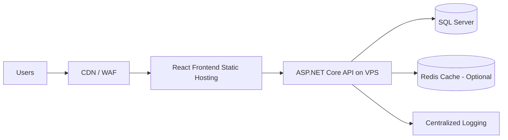
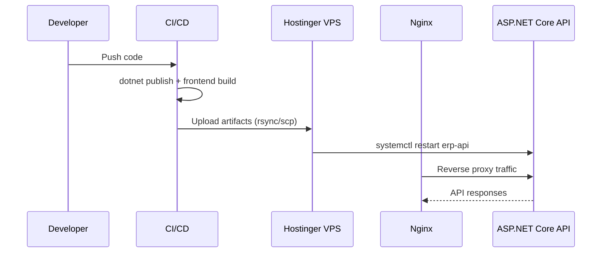

# Deployment Report: نشر مشروع **ASP.NET Core ERP System** على **Hostinger** باستخدام **cPanel / hPanel**

> **Audience:** Engineering Teams, DevOps Engineers, Technical Leads  
> **Goal:** دليل احترافي عملي لنشر نظام ERP مبني على ASP.NET Core و React على Hostinger بطريقة Production-Ready

---

## Table of Contents

1. [Executive Summary](#executive-summary)
2. [نظرة عامة على مكونات المشروع](#نظرة-عامة-على-مكونات-المشروع)
3. [الفرق بين Shared Hosting و VPS](#الفرق-بين-shared-hosting-و-vps)
4. [هل Hostinger مناسب لمشاريع .NET الكبيرة؟](#هل-hostinger-مناسب-لمشاريع-net-الكبيرة)
5. [مميزات وعيوب cPanel و hPanel](#مميزات-وعيوب-cpanel-و-hpanel)
6. [المشاكل المتوقعة عند رفع ASP.NET Core على Shared Hosting](#المشاكل-المتوقعة-عند-رفع-aspnet-core-على-shared-hosting)
7. [أفضل حلول النشر لمشاريع ERP](#أفضل-حلول-النشر-لمشاريع-erp)
8. [خطوات Publish لمشروع .NET](#خطوات-publish-لمشروع-net)
9. [خطوات رفع الملفات على الاستضافة](#خطوات-رفع-الملفات-على-الاستضافة)
10. [تثبيت .NET Runtime](#تثبيت-net-runtime)
11. [تشغيل التطبيق باستخدام Kestrel](#تشغيل-التطبيق-باستخدام-kestrel)
12. [إعداد Nginx Reverse Proxy](#إعداد-nginx-reverse-proxy)
13. [ربط الدومين](#ربط-الدومين)
14. [إعدادات البيئة (Environment Variables)](#إعدادات-البيئة-environment-variables)
15. [أفضل ممارسات الأمان](#أفضل-ممارسات-الأمان)
16. [إعداد Logging و Monitoring](#إعداد-logging-و-monitoring)
17. [إعداد HTTPS](#إعداد-https)
18. [أفضل Architecture للنشر](#أفضل-architecture-للنشر)
19. [فصل الـ Frontend عن الـ Backend](#فصل-الـ-frontend-عن-الـ-backend)
20. [أفضل خدمات بديلة لـ Hostinger لمشاريع .NET](#أفضل-خدمات-بديلة-لـ-hostinger-لمشاريع-net)
21. [نصائح Performance و Scalability](#نصائح-performance-و-scalability)
22. [المشاكل الشائعة وحلولها](#المشاكل-الشائعة-وحلولها)
23. [Appendix: قوالب وأوامر جاهزة](#appendix-قوالب-وأوامر-جاهزة)

---

## Executive Summary

لمشاريع ERP المعتمدة على **ASP.NET Core Web API + React + SQL Server + EF Core**:

- **Shared Hosting** غالبًا مناسب للتجارب/PoC وليس Production ثقيل.
- **VPS** هو الحد الأدنى الموصى به للإطلاق الفعلي.
- على Hostinger: استخدم Linux VPS مع **Nginx + Kestrel + systemd**.
- افصل Frontend و Backend لمرونة أعلى وقابلية توسع أفضل.
- اعتمد Logging مركزي، HTTPS إلزامي، ونسخ احتياطي دوري للقاعدة.

---

## نظرة عامة على مكونات المشروع

| Layer | Technology | Purpose |
|---|---|---|
| Frontend | React.js + Tailwind CSS | UI/UX، إدارة شاشات ERP |
| Backend | ASP.NET Core Web API | Business Logic + REST APIs |
| ORM | Entity Framework Core | Data Access + Migrations |
| Database | SQL Server | تخزين بيانات المعاملات |
| Web Server | Nginx (Reverse Proxy) | SSL termination + routing |
| App Server | Kestrel | تشغيل ASP.NET Core app |

---

## الفرق بين Shared Hosting و VPS

| معيار | Shared Hosting | VPS |
|---|---|---|
| العزل (Isolation) | منخفض | عالي |
| الأداء | متذبذب بسبب مشاركة الموارد | ثابت نسبيًا |
| التحكم بالنظام | محدود جدًا | كامل (Root Access) |
| دعم .NET Runtime | غالبًا غير مرن | يمكنك تثبيت أي نسخة |
| قابلية التوسع | ضعيفة | متوسطة إلى عالية |
| الأمان | أقل | أعلى مع ضبط صحيح |
| ملاءمة ERP | غير موصى به للإنتاج | موصى به |

**الخلاصة:**  
ERP = أحمال عمل أعلى + جلسات متعددة + تقارير + عمليات مالية ⇒ **VPS** أفضل بكثير.

---

## هل Hostinger مناسب لمشاريع .NET الكبيرة؟

### تقييم مختصر
- **مناسب** إذا استخدمت **VPS** بمواصفات قوية + إعداد DevOps جيد.
- **غير مناسب غالبًا** على Shared Hosting لمشروع ERP متوسط/كبير.

### متى يكون مناسب؟
- فريق قادر على إدارة Linux server.
- وجود خطة نسخ احتياطي ومراقبة.
- فصل الخدمات (Frontend, API, DB) تدريجيًا.

### متى لا يكون مناسب؟
- SLA صارم جدًا، High Availability متقدم، Auto-scaling تلقائي كامل.
- متطلبات Enterprise-grade managed cloud متقدمة (AKS/App Service level).

---

## مميزات وعيوب cPanel و hPanel

| عنصر | cPanel | hPanel (Hostinger) |
|---|---|---|
| الانتشار | واسع ومعروف | مخصص لـ Hostinger |
| سهولة الاستخدام | ممتاز | ممتاز جدًا للمبتدئين |
| المرونة المتقدمة | أكبر مع إضافات كثيرة | أقل نسبيًا |
| التكامل مع Hostinger | متوسط | عالٍ جدًا |
| إدارة متقدمة لـ .NET | محدودة غالبًا | محدودة على Shared |
| مناسب لـ VPS | نعم (إن متوفر) | نعم حسب الخطة |

### نقاط عملية
- لو عندك **VPS unmanaged**: ستعتمد أكثر على SSH وليس panel فقط.
- panel مفيد للـ DNS, SSL, File Manager، لكن تشغيل .NET الحقيقي يكون عبر terminal/systemd.

---

## المشاكل المتوقعة عند رفع ASP.NET Core على Shared Hosting

1. عدم القدرة على تثبيت Runtime المطلوب.
2. منع تشغيل process دائم (Kestrel) أو صلاحيات محدودة.
3. Timeouts مع طلبات ERP الثقيلة.
4. قيود RAM/CPU تؤثر على EF Core queries.
5. صعوبة إعداد Background Jobs (مثل Hangfire/Workers).
6. قيود على SQL Server أو latency مع DB خارجية.

---

## أفضل حلول النشر لمشاريع ERP

| حجم المشروع | حل مقترح |
|---|---|
| صغير/تجريبي | VPS واحد (API + Frontend + DB منفصل إن أمكن) |
| متوسط | VPS للتطبيق + Managed DB + CDN |
| كبير | Cloud Managed (Azure/AWS/GCP) + Load Balancer + Multi-instance |

**Production Recommendation (Balanced):**
- Frontend: Static hosting/CDN
- Backend: Hostinger VPS (Nginx + Kestrel)
- Database: Managed SQL Server (يفضل خارج نفس السيرفر)
- Backup: يومي + أسبوعي مشفر

---

## خطوات Publish لمشروع .NET

## 1) Build & Restore
```bash
dotnet restore
dotnet build -c Release
```

## 2) Publish API
```bash
dotnet publish ./src/ERP.Api/ERP.Api.csproj \
  -c Release \
  -o ./publish/api \
  --self-contained false \
  /p:UseAppHost=false
```

## 3) اختياري: Self-contained
```bash
dotnet publish ./src/ERP.Api/ERP.Api.csproj \
  -c Release \
  -r linux-x64 \
  --self-contained true \
  -o ./publish/api-sc
```

## 4) Frontend Build
```bash
cd ./src/erp-frontend
npm ci
npm run build
```

---

## خطوات رفع الملفات على الاستضافة

### باستخدام SCP
```bash
scp -r ./publish/api user@your-vps-ip:/var/www/erp-api
scp -r ./src/erp-frontend/dist/* user@your-vps-ip:/var/www/erp-frontend
```

### باستخدام rsync (أفضل للتحديثات)
```bash
rsync -avz --delete ./publish/api/ user@your-vps-ip:/var/www/erp-api/
rsync -avz --delete ./src/erp-frontend/dist/ user@your-vps-ip:/var/www/erp-frontend/
```

---

## تثبيت .NET Runtime

> على VPS Linux (Ubuntu مثال):

```bash
sudo apt-get update
sudo apt-get install -y dotnet-runtime-8.0
dotnet --info
```

إذا احتجت ASP.NET Runtime:
```bash
sudo apt-get install -y aspnetcore-runtime-8.0
```

---

## تشغيل التطبيق باستخدام Kestrel

```bash
cd /var/www/erp-api
dotnet ERP.Api.dll
```

تحديد بورت:
```bash
ASPNETCORE_URLS=http://127.0.0.1:5000 dotnet ERP.Api.dll
```

### systemd service (Production)
```ini
# /etc/systemd/system/erp-api.service
[Unit]
Description=ERP ASP.NET Core API
After=network.target

[Service]
WorkingDirectory=/var/www/erp-api
ExecStart=/usr/bin/dotnet /var/www/erp-api/ERP.Api.dll
Restart=always
RestartSec=5
KillSignal=SIGINT
SyslogIdentifier=erp-api
User=www-data
Environment=ASPNETCORE_ENVIRONMENT=Production
Environment=ASPNETCORE_URLS=http://127.0.0.1:5000

[Install]
WantedBy=multi-user.target
```

تفعيل الخدمة:
```bash
sudo systemctl daemon-reload
sudo systemctl enable erp-api
sudo systemctl start erp-api
sudo systemctl status erp-api
```

---

## إعداد Nginx Reverse Proxy

```nginx
# /etc/nginx/sites-available/erp-api.conf
server {
    listen 80;
    server_name api.example.com;

    location / {
        proxy_pass         http://127.0.0.1:5000;
        proxy_http_version 1.1;

        proxy_set_header   Upgrade $http_upgrade;
        proxy_set_header   Connection keep-alive;
        proxy_set_header   Host $host;
        proxy_set_header   X-Real-IP $remote_addr;
        proxy_set_header   X-Forwarded-For $proxy_add_x_forwarded_for;
        proxy_set_header   X-Forwarded-Proto $scheme;

        proxy_cache_bypass $http_upgrade;
    }
}
```

تفعيل:
```bash
sudo ln -s /etc/nginx/sites-available/erp-api.conf /etc/nginx/sites-enabled/
sudo nginx -t
sudo systemctl reload nginx
```

---

## ربط الدومين

1. أضف A record:
   - `api.example.com -> VPS_IP`
   - `app.example.com -> VPS_IP` (أو CDN endpoint)
2. انتظر propagation.
3. تحقق:
```bash
dig +short api.example.com
```

---

## إعدادات البيئة (Environment Variables)

أمثلة مهمة:

```bash
ASPNETCORE_ENVIRONMENT=Production
ConnectionStrings__DefaultConnection=Server=...;Database=...;User Id=...;Password=...;
Jwt__Issuer=https://api.example.com
Jwt__Audience=https://app.example.com
Jwt__Key=<strong-random-key>
Serilog__MinimumLevel__Default=Information
```

**Best Practice:**  
لا تضع secrets داخل `appsettings.json` في الإنتاج؛ استخدم environment variables أو Secret Manager/Vault.

---

## أفضل ممارسات الأمان

- تعطيل المنافذ غير الضرورية (UFW/Security Groups).
- تفعيل Fail2Ban و SSH hardening.
- استخدام مفاتيح SSH بدل كلمات المرور.
- تطبيق مبدأ أقل صلاحية (Least Privilege) لقاعدة البيانات.
- تدوير مفاتيح JWT دوريًا.
- WAF/CDN (Cloudflare مثلًا) لحماية الطبقة الأمامية.
- تفعيل Rate Limiting على API.
- تحديثات أمنية دورية للنظام والحزم.

---

## إعداد Logging و Monitoring

### Logging
- استخدم Serilog (File + Console + Seq/ELK).
- Structured logs مع Correlation ID.

### Monitoring
- System metrics: CPU/RAM/Disk.
- App metrics: Request latency, error rate.
- Alerts: 5xx spikes, DB timeouts, disk usage > 80%.

### مثال Serilog في `appsettings.Production.json`
```json
{
  "Serilog": {
    "Using": ["Serilog.Sinks.Console", "Serilog.Sinks.File"],
    "MinimumLevel": "Information",
    "WriteTo": [
      { "Name": "Console" },
      { "Name": "File", "Args": { "path": "/var/log/erp-api/log-.txt", "rollingInterval": "Day" } }
    ]
  }
}
```

---

## إعداد HTTPS

باستخدام Certbot (Let’s Encrypt):
```bash
sudo apt-get install -y certbot python3-certbot-nginx
sudo certbot --nginx -d api.example.com -d app.example.com
```

اختبار التجديد:
```bash
sudo certbot renew --dry-run
```

---

## أفضل Architecture للنشر



### Architecture Layers
- Edge: CDN + WAF
- Presentation: React SPA
- API Layer: ASP.NET Core
- Data Layer: SQL Server + Cache
- Observability: Logs + Metrics + Alerts

---

## فصل الـ Frontend عن الـ Backend

### لماذا؟
- Deploy مستقل لكل جزء.
- Scale مستقل (مثلاً API فقط).
- أمان أفضل (تقليل surface area).

### نموذج Domains
- Frontend: `app.example.com`
- Backend: `api.example.com`

### CORS Example
```csharp
builder.Services.AddCors(options =>
{
    options.AddPolicy("FrontendPolicy", policy =>
        policy.WithOrigins("https://app.example.com")
              .AllowAnyHeader()
              .AllowAnyMethod());
});
```

---

## أفضل خدمات بديلة لـ Hostinger لمشاريع .NET

| Provider | مناسب لـ | ملاحظات |
|---|---|---|
| Azure App Service | .NET enterprise | Managed ممتاز |
| Azure AKS | Microservices | تعقيد أعلى |
| AWS ECS/Fargate | Container workloads | مرن وقابل للتوسع |
| DigitalOcean Droplets | VPS اقتصادي | إدارة يدوية |
| Hetzner Cloud | أداء/سعر ممتاز | unmanaged غالبًا |

---

## نصائح Performance و Scalability

- EF Core:
  - استخدم `AsNoTracking()` للقراءة.
  - فهارس DB للأعمدة كثيرة الاستخدام.
  - Pagination بدل تحميل كامل النتائج.
- API:
  - Response compression.
  - Caching (Redis/Memory).
  - Async I/O في جميع العمليات.
- Frontend:
  - Code splitting.
  - Lazy loading.
  - CDN caching للملفات الثابتة.
- Infra:
  - Vertical scaling أولًا، ثم horizontal.
  - Read replicas للتقارير الثقيلة.

---

## المشاكل الشائعة وحلولها

| المشكلة | السبب المحتمل | الحل |
|---|---|---|
| 502 Bad Gateway | Kestrel متوقف أو port mismatch | تحقق من `systemctl status` و `proxy_pass` |
| 500 Internal Error | خطأ config أو env vars | راجع logs + appsettings |
| CORS Errors | Origins غير مضافة | اضبط CORS policy بدقة |
| DB Connection Timeout | Firewall/connection string/latency | راجع الشبكة و pooling |
| SSL not working | DNS غير محدث أو cert issue | تحقق من A records + certbot |

---

## Mermaid Diagram: Deployment Pipeline



---

## أمثلة عملية (End-to-End Quick Runbook)

1. Build + Publish API  
2. Build React  
3. Upload artifacts  
4. Configure systemd service  
5. Configure Nginx server blocks  
6. Enable SSL  
7. Set env vars  
8. Restart and verify logs

### Verify Commands
```bash
curl -I https://api.example.com/health
sudo systemctl status erp-api
sudo journalctl -u erp-api -n 100 --no-pager
sudo nginx -t
```

---

## Appendix: قوالب وأوامر جاهزة

### appsettings.Production.json (مقتطف)
```json
{
  "ConnectionStrings": {
    "DefaultConnection": "Server=...;Database=ERP;User Id=...;Password=...;TrustServerCertificate=True"
  },
  "AllowedHosts": "*"
}
```

### Health Check Endpoint (ASP.NET Core)
```csharp
builder.Services.AddHealthChecks();
app.MapHealthChecks("/health");
```

### SQL Server Connection Best Practices
- تفعيل connection pooling.
- timeout مناسب.
- user بصلاحيات محدودة.

---

## Final Recommendation (قرار معماري)

**لـ ERP Production:**  
- لا تعتمد على Shared Hosting.  
- استخدم **Hostinger VPS** على الأقل (4 vCPU / 8GB RAM كبداية تقريبية حسب الحمل).  
- افصل Frontend عن Backend.  
- طبّق Nginx + Kestrel + systemd + HTTPS + Monitoring منذ اليوم الأول.  
- خطط للترحيل إلى managed cloud عند نمو المستخدمين/المعاملات.

---

**End of Report**
