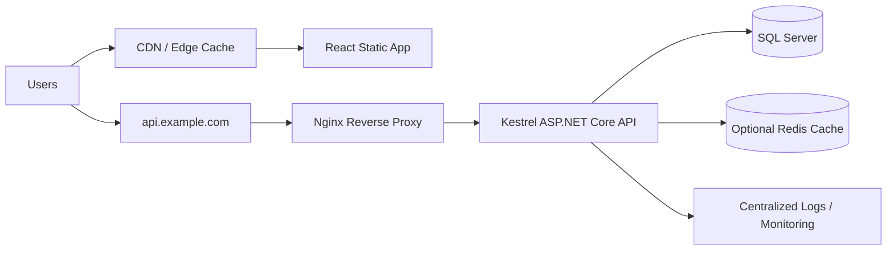
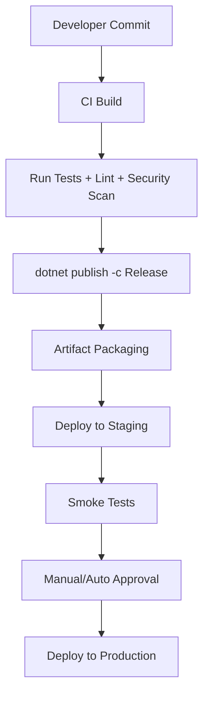
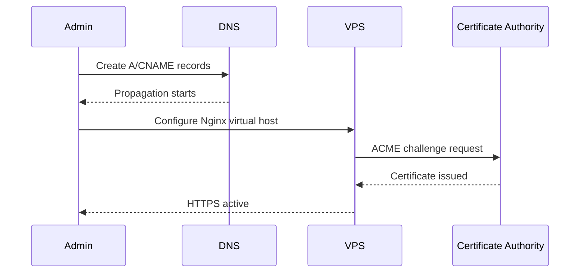
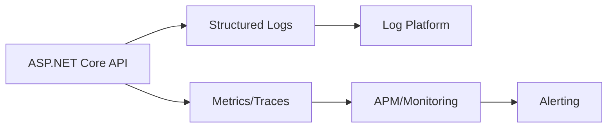
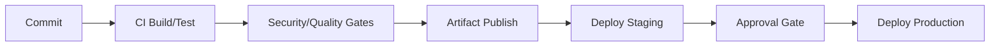
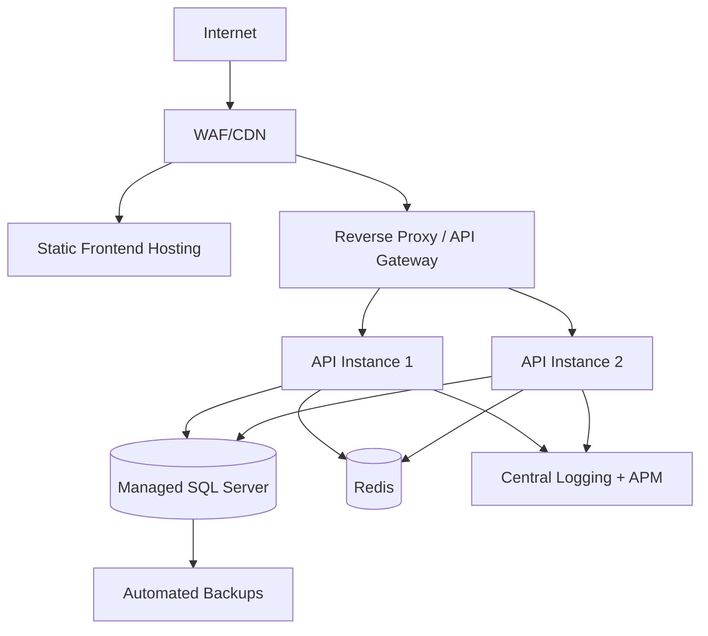

# Deployment Report - ASP.NET Core ERP System on Hostinger

## Project Stack

| Layer | Technology | Notes |
|---|---|---|
| Backend | ASP.NET Core Web API | Stateless REST API, recommended to run behind reverse proxy |
| Frontend | React.js + Tailwind CSS | Build to static assets, serve via Nginx/CDN |
| Database | SQL Server | Prefer managed/isolated host rather than shared-host local DB |
| ORM | Entity Framework Core | Use migrations pipeline with controlled rollout |
| Hosting Target | Hostinger (hPanel/cPanel/VPS) | Shared hosting possible with constraints; VPS recommended for production |

---

## Hosting Analysis

### Shared Hosting (cPanel / hPanel)

#### Advantages
- Lower cost and fast setup.
- Built-in panel features (DNS, SSL, file manager, backups).
- Good fit for prototype/demo workloads.

#### Disadvantages
- Limited control over OS, runtime versions, background services, ports.
- ASP.NET Core support may be constrained by hosting plan/runtime availability.
- Resource contention (CPU/RAM/IO) and noisy-neighbor risk.
- Limited observability and custom hardening options.

#### Recommended Usage
- Internal demos, MVP validation, low-traffic non-critical deployments.
- Avoid for mission-critical ERP or strict compliance workloads.

### VPS Hosting

#### Advantages
- Full root/admin control (Linux/Windows), custom runtime and security stack.
- Predictable performance and easier horizontal/vertical scaling.
- Proper process management (systemd/IIS), reverse proxy, monitoring integration.
- Better fit for enterprise-grade reliability and compliance.

#### Disadvantages
- Higher operational complexity and responsibility.
- Requires patching, hardening, backup validation, monitoring ownership.
- Potentially higher monthly cost.

#### Recommended Usage
- Production ERP deployments.
- Multi-environment (dev/stage/prod) and CI/CD-driven operations.

### Hosting Options Comparison

| Criterion | Shared Hosting | VPS |
|---|---|---|
| Cost | Low | Medium–High |
| Control | Low | High |
| Performance Isolation | Low | High |
| ASP.NET Core Flexibility | Limited | Full |
| Security Hardening | Limited | Full |
| Recommended for ERP Production | No | Yes |

---

## Recommended Deployment Architecture



### Key Architecture Decisions
- Serve frontend and API on separate subdomains for clear boundary and scaling.
- Keep API stateless to allow multi-instance scaling.
- Place SQL Server on managed/isolated host; avoid colocating on constrained shared hosting.
- Use TLS termination at Nginx and forward to Kestrel internally.

---

## ASP.NET Core Publish Workflow



### Publish Commands

```bash
# Restore and build
 dotnet restore
 dotnet build -c Release

# Publish self-contained (example Linux x64)
 dotnet publish -c Release -r linux-x64 --self-contained false -o ./publish

# Optional: EF migration script
 dotnet ef migrations script --idempotent -o ./artifacts/migrations.sql
```

### Artifact Checklist
- Published binaries (`publish/`)
- `appsettings.Production.json` template (without secrets)
- Deployment scripts (systemd/IIS/Nginx)
- Migration script and rollback plan

---

## Linux VPS Setup

1. Provision Ubuntu LTS VPS on Hostinger.
2. Create non-root sudo user and disable password SSH login.
3. Configure firewall (UFW): allow `22`, `80`, `443`.
4. Install .NET runtime, Nginx, certbot.
5. Deploy app to `/var/www/erp-api`.
6. Register `systemd` service for API.
7. Configure Nginx reverse proxy and TLS.
8. Validate health endpoint and logs.

```bash
sudo apt update && sudo apt upgrade -y
sudo apt install -y nginx ufw
sudo ufw allow OpenSSH
sudo ufw allow 'Nginx Full'
sudo ufw enable
```

### Sample systemd Unit

```ini
# /etc/systemd/system/erp-api.service
[Unit]
Description=ERP ASP.NET Core API
After=network.target

[Service]
WorkingDirectory=/var/www/erp-api
ExecStart=/usr/bin/dotnet /var/www/erp-api/ERP.Api.dll
Restart=always
RestartSec=10
KillSignal=SIGINT
SyslogIdentifier=erp-api
User=www-data
Environment=ASPNETCORE_ENVIRONMENT=Production
Environment=DOTNET_PRINT_TELEMETRY_MESSAGE=false

[Install]
WantedBy=multi-user.target
```

```bash
sudo systemctl daemon-reload
sudo systemctl enable erp-api
sudo systemctl start erp-api
sudo systemctl status erp-api
```

---

## Windows VPS Setup

1. Provision Windows Server VPS.
2. Install .NET Hosting Bundle and IIS.
3. Enable IIS modules: ASP.NET Core Module V2.
4. Create dedicated App Pool and site.
5. Configure `web.config` + environment variables.
6. Bind domain and install SSL certificate.
7. Restrict RDP and enable Windows Firewall.

### IIS Deployment Notes
- Use separate App Pool identity with least privileges.
- Enable stdout logs only for short-term troubleshooting.
- Configure recycling windows during low-traffic periods.

---

## Installing .NET Runtime

### Ubuntu (Microsoft package feed)

```bash
wget https://packages.microsoft.com/config/ubuntu/22.04/packages-microsoft-prod.deb -O packages-microsoft-prod.deb
sudo dpkg -i packages-microsoft-prod.deb
sudo apt update
sudo apt install -y aspnetcore-runtime-8.0

# Verify
 dotnet --info
```

### Windows
- Download and install **.NET Hosting Bundle** matching your target framework.
- Reboot IIS services after installation:

```powershell
iisreset
```

---

## Nginx Reverse Proxy Configuration

```nginx
# /etc/nginx/sites-available/erp-api
server {
    listen 80;
    server_name api.example.com;

    location / {
        proxy_pass         http://127.0.0.1:5000;
        proxy_http_version 1.1;
        proxy_set_header   Upgrade $http_upgrade;
        proxy_set_header   Connection keep-alive;
        proxy_set_header   Host $host;
        proxy_cache_bypass $http_upgrade;
        proxy_set_header   X-Forwarded-For $proxy_add_x_forwarded_for;
        proxy_set_header   X-Forwarded-Proto $scheme;
    }
}
```

```bash
sudo ln -s /etc/nginx/sites-available/erp-api /etc/nginx/sites-enabled/
sudo nginx -t
sudo systemctl reload nginx
```

### TLS (Let’s Encrypt)

```bash
sudo apt install -y certbot python3-certbot-nginx
sudo certbot --nginx -d api.example.com
```

---

## Domain & DNS Configuration

| Record Type | Host | Target | Purpose |
|---|---|---|---|
| A | `@` | VPS Public IP | Root domain |
| A | `api` | VPS Public IP | API endpoint |
| CNAME | `www` | `@` | Canonical web host |

### DNS/SSL Sequence



---

## Frontend Deployment Recommendations

- Build React app in CI and deploy static assets to:
  - Nginx web root on VPS, or
  - object storage + CDN (preferred for scale).
- Enable cache busting with hashed filenames.
- Set strict CSP and security headers.

```bash
npm ci
npm run build
# Deploy dist/build output to /var/www/erp-frontend
```

### SPA Nginx Example

```nginx
server {
    listen 80;
    server_name app.example.com;
    root /var/www/erp-frontend;
    index index.html;

    location / {
        try_files $uri /index.html;
    }
}
```

---

## Database Hosting Recommendations

### Preferred Options
1. Managed SQL Server (cloud DBaaS) with automated backups and HA.
2. Dedicated SQL Server VM with hardened network ACLs.

### Avoid
- Hosting SQL Server on low-tier shared hosting for production ERP.

### Data Layer Controls
- Enable encryption at rest and in transit (TLS).
- Restrict inbound DB access to API private IP/security group.
- Use EF Core migrations with change management approvals.

---

## Security Best Practices

- Enforce HTTPS with HSTS.
- Disable direct Kestrel public exposure; bind locally.
- Apply least-privilege service accounts.
- Rotate secrets and certificates regularly.
- Enable WAF/rate limiting for public APIs.
- Add dependency and container image scanning in CI.
- Patch OS/runtime on a defined cadence.

### Security Headers (Nginx snippet)

```nginx
add_header X-Frame-Options "DENY" always;
add_header X-Content-Type-Options "nosniff" always;
add_header Referrer-Policy "strict-origin-when-cross-origin" always;
add_header Content-Security-Policy "default-src 'self';" always;
```

---

## Environment Variables Handling

- Never store secrets in source control.
- Use Hostinger panel secret settings or server-level env files.
- Keep separate values per environment (dev/stage/prod).

### Example

```bash
# /etc/environment (or systemd EnvironmentFile)
ConnectionStrings__DefaultConnection="Server=tcp:sql.example.com,1433;Database=ERP;User ID=erp_user;Password=***;Encrypt=True;TrustServerCertificate=False;"
Jwt__Issuer="https://api.example.com"
Jwt__Audience="https://app.example.com"
```

---

## Logging & Monitoring

- Use structured logging (Serilog or built-in JSON logger).
- Centralize logs (ELK/OpenSearch/Grafana Loki/Azure Monitor).
- Expose health checks (`/health`, `/ready`).
- Track SLOs: latency, error rate, saturation, availability.

### Observability Flow



---

## Backup Strategy

| Asset | Frequency | Retention | Validation |
|---|---|---|---|
| SQL Server Full Backup | Daily | 30–90 days | Monthly restore test |
| SQL Transaction Logs | 5–15 min | 7–14 days | Point-in-time drill |
| App Artifacts | Every release | 10–20 releases | Rollback simulation |
| Config & IaC | On change | Versioned | Peer review |

### Backup Principles
- Follow 3-2-1 strategy.
- Store copies in separate region/provider where possible.
- Test restore regularly; untested backups are unreliable backups.

---

## CI/CD Recommendations

- Use GitHub Actions/GitLab CI/Azure DevOps with environment protection gates.
- Pipeline stages: build → test → security scan → publish → deploy staging → verify → deploy production.
- Use blue/green or rolling deployments for minimal downtime.



---

## Common Deployment Problems and Solutions

| Problem | Root Cause | Solution |
|---|---|---|
| 502 Bad Gateway | API process down or wrong proxy port | Check `systemctl status`, verify `proxy_pass` target |
| 500.30 startup failure | Missing runtime/config error | Install correct runtime, inspect app logs |
| CORS errors | Misconfigured origin policy | Set explicit allowed origins per environment |
| EF migration failures | Schema drift or permissions | Run idempotent scripts with DBA-approved account |
| SSL renewal failure | DNS/port challenge issues | Revalidate DNS, port 80/443 reachability, certbot logs |
| Slow responses | Under-provisioned VPS/DB bottleneck | Profile queries, add caching, scale resources |

---

## Recommended Production Architecture



### Production Readiness Checklist
- [ ] Infrastructure as Code baseline defined.
- [ ] Secrets externalized and rotation policy implemented.
- [ ] Health checks and alerting thresholds configured.
- [ ] Backups tested with documented RTO/RPO.
- [ ] Rollback procedure verified in staging.
- [ ] Security hardening and vulnerability scans passing.

---

This report is designed as an enterprise-ready deployment baseline for hosting an ASP.NET Core ERP system on Hostinger, with VPS as the recommended production target and shared hosting reserved for non-critical scenarios.
