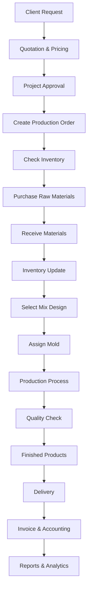

# Final ERP Workflow — Concrete Manufacturing Factory

## 1. System Overview

This document defines a unified, production-ready ERP workflow for a concrete manufacturing factory. It aligns the core modules—**Projects, Inventory, Production, Purchasing, Accounting, Mold Management, and Mix Design**—into one controlled process from client request to analytics.

The workflow is designed to be:
- **Simple:** one end-to-end operational flow.
- **Traceable:** each transaction is linked to a project and production order.
- **Operationally safe:** inventory, quality, and accounting checkpoints are embedded.

| Module | Primary Responsibility |
|---|---|
| Projects | Client requests, quotations, approvals, and job tracking |
| Purchasing | Raw material procurement and supplier coordination |
| Inventory | Stock visibility, receiving, and material issuance |
| Mix Design | Selection of approved concrete mix formulas |
| Mold Management | Mold assignment, capacity, and usage tracking |
| Production | Production planning, execution, and quality checks |
| Accounting | Expense capture, invoicing, posting, and financial control |

## 2. Unified ERP Workflow Diagram

## 3. Workflow Stages Description

| Stage | Description | Owning Module(s) |
|---|---|---|
| Client Request | Capture customer need, quantity, specs, and target delivery date. | Projects |
| Quotation & Pricing | Generate cost-based quotation with margin and commercial terms. | Projects, Accounting |
| Project Approval | Approve project scope, budget, and planned timeline. | Projects |
| Create Production Order | Convert approved project demand into a production order. | Production, Projects |
| Check Inventory | Validate availability of cement, aggregates, additives, and consumables. | Inventory |
| Purchase Raw Materials | Create and release purchase orders for shortages. | Purchasing |
| Receive Materials | Receive supplier deliveries and perform goods receiving checks. | Purchasing, Inventory |
| Inventory Update | Post received quantities to stock and reserve for production. | Inventory |
| Select Mix Design | Apply approved mix formula based on project/quality requirements. | Mix Design, Production |
| Assign Mold | Allocate suitable molds according to product type and capacity. | Mold Management, Production |
| Production Process | Execute batching, casting, curing, and operational logging. | Production |
| Quality Check | Validate dimensions, strength, and compliance before release. | Production |
| Finished Products | Move accepted items to finished-goods inventory. | Production, Inventory |
| Delivery | Plan dispatch and deliver against customer order. | Projects, Inventory |
| Invoice & Accounting | Issue invoices, post revenue/expenses, and reconcile transactions. | Accounting |
| Reports & Analytics | Provide operational and financial KPIs for management. | Accounting, Projects, Production |

## 4. Main APIs

### Core Transaction APIs by Stage

| Workflow Stage | API Examples | Purpose |
|---|---|---|
| Client Request / Quotation | `POST /api/projects`  \|  `POST /api/quotations` | Register client job and issue pricing proposal |
| Project Approval | `POST /api/projects/{id}/approve` | Approve and lock project for execution |
| Production Order | `POST /api/production-orders` | Create manufacturing order from approved demand |
| Inventory Check | `GET /api/inventory` | Retrieve real-time stock balances |
| Purchasing | `POST /api/purchase-orders` | Procure missing raw materials |
| Material Receipt | `POST /api/inventory/receipts` | Record goods receipt from supplier |
| Mix & Mold Assignment | `POST /api/mix-design/selections`  \|  `POST /api/molds/assignments` | Bind mix formula and mold to order |
| Production & QC | `POST /api/production-orders/{id}/start`  \|  `POST /api/quality-checks` | Execute production and capture quality outcomes |
| Delivery | `POST /api/deliveries` | Dispatch finished products to client |
| Accounting | `POST /api/expenses`  \|  `POST /api/invoices` | Post costs and billing entries |
| Reporting | `GET /api/reports` | Generate KPI and management reports |

### Required API Set (minimum)
- `POST /api/projects`
- `POST /api/quotations`
- `POST /api/production-orders`
- `GET /api/inventory`
- `POST /api/purchase-orders`
- `POST /api/expenses`
- `GET /api/reports`

## 5. Core Business Rules

1. **Approval Gate:** Production orders can be created only after project approval.
2. **Inventory Gate:** If required materials are below threshold, purchasing is mandatory before production start.
3. **Mix Compliance:** Only approved mix designs can be assigned to production orders.
4. **Mold Availability:** Mold assignment requires active, available mold capacity.
5. **Quality Release:** Finished products are deliverable only after quality check pass.
6. **Financial Integrity:** Delivery requires invoice creation and accounting posting for full traceability.
7. **Auditability:** Every major transaction must reference project ID and production order ID.

## 6. Final Notes

- This architecture is intentionally simple to support fast implementation and operational control.
- Keep master data (materials, mix formulas, molds, customer terms) centrally governed.
- Use role-based permissions for approvals, purchasing, inventory posting, and financial actions.
- Track KPIs at minimum: on-time delivery, production yield, material variance, and project margin.
- The workflow can be extended later with maintenance, HR, or mobile shop-floor integration without changing the core sequence.
