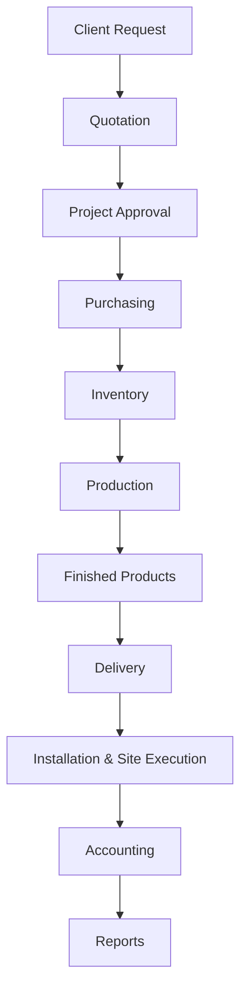

# Final ERP Workflow — Concrete Manufacturing Factory

## 1. System Overview

This document defines a unified, end-to-end ERP workflow for a concrete manufacturing factory. The process connects commercial, operational, and financial functions in one controlled lifecycle.

The covered modules are:

- Projects
- Inventory
- Production
- Purchasing
- Accounting
- Mold Management
- Mix Design
- Installation & Site Execution

The workflow starts with client demand and ends with financial closure and management reporting.

---

## 2. Unified ERP Workflow Diagram

---

## 3. Workflow Stages Description

### 1) Client Request
Customer requirements are captured (product type, quantity, site location, delivery timeline, technical constraints) and converted into a formal sales opportunity.

### 2) Quotation
Commercial and technical teams prepare pricing using material estimates, mix design assumptions, mold usage, transport factors, and expected installation scope.

### 3) Project Approval
Approved quotation is converted into a project with budget, milestones, responsible teams, and baseline profitability targets.

### 4) Purchasing
Procurement creates purchase orders for cement, aggregates, steel, additives, consumables, and external services based on project and production plans.

### 5) Inventory
Received materials are quality-checked and posted to stock. Inventory availability and reservations are managed against production orders.

### 6) Production
Production orders are executed using approved mix designs and assigned molds. Batch records, resource usage, and quality checkpoints are logged.

### 7) Finished Products
Completed units are moved to finished-goods status after QA release, ready for dispatch to customer sites.

### 8) Delivery
Dispatch and logistics deliver products to site. Delivery documents and on-site receipt confirmation are mandatory before installation starts.

### 9) Installation & Site Execution
Site execution is managed as a controlled stage that includes:

- On-site delivery confirmation
- Installation operations
- Installation team assignment
- Installation cost tracking
- Equipment usage tracking
- Final handover to client
- Site completion report

This stage links field execution directly to project progress, cost capture, and acceptance criteria.

### 10) Accounting
Revenue, expenses, procurement liabilities, production costs, delivery charges, and installation costs are posted and reconciled per project.

### 11) Reports
Operational and financial dashboards provide visibility on project status, cost variance, installation performance, and margin outcomes.

---

## 4. Main APIs

Below are representative APIs aligned to each workflow stage.

### Client Request / Quotation / Project
- `POST /api/projects`
- `POST /api/quotations`
- `GET /api/projects/{projectId}`
- `PATCH /api/projects/{projectId}/status`

### Purchasing
- `POST /api/purchase-orders`
- `GET /api/purchase-orders/{poId}`
- `POST /api/goods-receipts`

### Inventory
- `GET /api/inventory`
- `POST /api/inventory/transactions`
- `POST /api/inventory/reservations`

### Production / Mix / Mold
- `POST /api/production-orders`
- `GET /api/production-orders/{orderId}`
- `POST /api/mix-designs/select`
- `POST /api/molds/assign`

### Finished Products / Delivery
- `POST /api/finished-products`
- `POST /api/deliveries`
- `POST /api/deliveries/{deliveryId}/confirm-onsite`

### Installation & Site Execution
- `POST /api/installation-orders`
- `POST /api/installation-orders/{installationId}/assign-team`
- `POST /api/installation-costs`
- `POST /api/site-equipment-usage`
- `POST /api/installation-orders/{installationId}/handover`
- `POST /api/site-completion-reports`

### Accounting / Reporting
- `POST /api/expenses`
- `POST /api/invoices`
- `POST /api/accounting/journal-entries`
- `GET /api/reports`

---

## 5. Core Business Rules

1. No installation without delivery confirmation.
2. Installation cost must be linked to a project and installation order.
3. Equipment usage must be tracked per site and execution date.
4. Project cannot be closed before installation completion and client handover.
5. Mix design and mold assignment must be approved before production release.
6. Material consumption must be posted against production orders.
7. Financial posting must reconcile project revenue and direct costs before final closure.

---

## 6. Final Notes

- The ERP system supports the full lifecycle from sales → production → delivery → installation → accounting.
- Installation is a mandatory part of project closing and customer acceptance.
- Cost tracking is fully integrated across purchasing, production, logistics, site execution, and finance.
- Unified reporting improves control of schedule, quality, and profitability.
