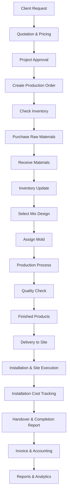

# Final ERP Workflow — Concrete Manufacturing Factory

## 1. System Overview

This ERP workflow covers the full operational lifecycle for a concrete manufacturing factory, from initial client demand through project execution, production, delivery, installation, financial closure, and reporting. The process integrates core modules: **Projects, Inventory, Production, Purchasing, Accounting, Mold Management, Mix Design, and Installation & Site Execution**.

The architecture is intentionally simple: each stage completes key validations and passes structured data to the next stage to ensure traceability, cost control, and on-time execution.

---

## 2. Unified ERP Workflow Diagram

---

## 3. Workflow Stages Description

1. **Client Request**  
   Customer submits product/site requirements, quantities, and timelines.

2. **Quotation & Pricing**  
   Commercial team prepares pricing based on mix, mold, delivery, and installation scope.

3. **Project Approval**  
   Approved quotation becomes a project with defined budget, milestones, and ownership.

4. **Create Production Order**  
   Production demand is generated from approved project quantities and delivery plan.

5. **Check Inventory**  
   Raw material stock is verified against production requirements.

6. **Purchase Raw Materials**  
   Purchasing creates POs for shortages and confirms supplier lead times.

7. **Receive Materials**  
   Inbound goods are received, inspected, and accepted.

8. **Inventory Update**  
   Accepted quantities are posted to stock and reserved for project production.

9. **Select Mix Design**  
   Engineering selects approved concrete mix formula per product specification.

10. **Assign Mold**  
    Mold Management assigns available molds and tracks usage/capacity.

11. **Production Process**  
    Manufacturing executes batching, casting, curing, and internal progress tracking.

12. **Quality Check**  
    QC validates dimensions, strength, and finish before release.

13. **Finished Products**  
    Passed items are moved to finished goods inventory and linked to project lots.

14. **Delivery to Site**  
    Logistics dispatches products to site with shipment and on-site delivery confirmation.

15. **Installation & Site Execution**  
    Site team assignment is issued; installation operations are executed; equipment usage is logged per site; progress is monitored against project scope.

16. **Installation Cost Tracking**  
    Labor, equipment, transport, and site expenses are posted and tied to project cost centers.

17. **Handover & Completion Report**  
    Final handover to client is completed with site completion report and sign-off records.

18. **Invoice & Accounting**  
    Billing, expense recognition, and financial postings are completed.

19. **Reports & Analytics**  
    Management reviews project profitability, production efficiency, installation performance, and financial KPIs.

---

## 4. Main APIs

### Projects & Commercial
- `POST /api/projects` — Create approved project
- `POST /api/quotations` — Create quotation

### Production & Planning
- `POST /api/production-orders` — Create production order
- `GET /api/inventory` — Check material/FG availability

### Purchasing & Inventory
- `POST /api/purchase-orders` — Create purchase order
- `POST /api/goods-receipts` — Receive materials
- `POST /api/inventory-transactions` — Update inventory balances

### Mix Design & Mold Management
- `GET /api/mix-designs/{id}` — Retrieve approved mix design
- `POST /api/mold-assignments` — Assign mold to production order

### Logistics & Installation
- `POST /api/deliveries` — Dispatch to site and capture delivery confirmation
- `POST /api/installation-orders` — Create/assign installation work order
- `POST /api/installation-costs` — Record installation costs
- `POST /api/equipment-usage` — Track equipment usage per site
- `POST /api/site-completion-reports` — Submit completion report and handover details

### Accounting & Reporting
- `POST /api/expenses` — Record project/site expenses
- `POST /api/invoices` — Generate customer invoice
- `GET /api/reports` — Retrieve operational and financial reports

---

## 5. Core Business Rules

- No installation without on-site delivery confirmation.
- Installation cost entries must be linked to a valid project.
- Equipment usage must be recorded per site and per installation order.
- Project cannot be closed before installation completion and client handover.
- Finished products can be invoiced only after QC pass and delivery confirmation.
- Purchase orders must reference production demand or approved replenishment policy.

---

## 6. Final Notes

- The ERP system supports the full lifecycle: **sales → production → delivery → installation → accounting**.
- Installation is a mandatory stage in project closing and customer acceptance.
- Cost tracking is fully integrated across purchasing, production, logistics, installation, and finance.
- The workflow is designed for traceability, operational control, and profitability visibility.
